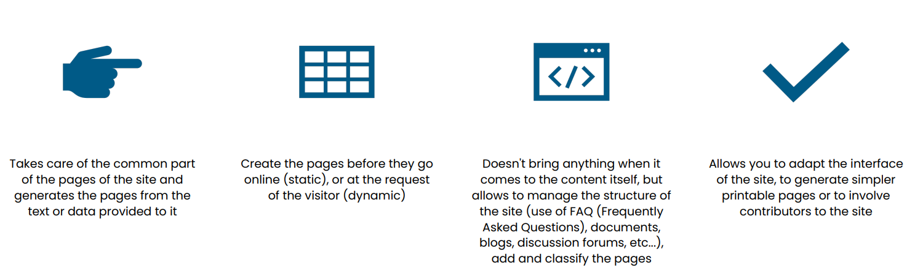

# Chapter 1 : An introduction to the web

## 
 Table of contents 

- History of the web
- Client-server architecture
- Static vs dynamic web
- The difference between front-end and back-end 
- Website editors and frameworks

## 
 The Web: what you need to know! 

{:style="width:700px;height:300px;:class="centered-image"}

## 
 A little bit of history… 

{:style="width:800px;height:300px;"}

{:style="width:800px;height:300px;"}

##### 
 What is the Internet? 

{:style="width:500px;height:200px;"}

A global computer network consisting of a set of national, regional and private networks (networks of networks), which are linked by the TCP/IP communication protocol and which work together to provide a unique interface to their users.

**TCP/IP communication protocol:** 
**(Transmission Control Protocol/Internet Protocol)**
Is a set of rules used to enable communication between devices on a computer network. It is widely used as a communications protocol on the Internet, and is also used in many local area networks (LANs) and corporate networks.

##### 
 Network & Computer network 

{:style="width:700px;height:300px;"}

##### 
 Communication protocol & TCP/IP suite 

{:style="width:800px;height:300px;"}

##### 
 The key players of the Internet 

{:style="width:900px;height:350px;"}

##### 
 Some examples of Internet protocols 

{:style="width:800px;height:300px;"}

##### 
 Internet services 

{:style="width:600px;height:300px;"}

##### 
 World Wide Web (WWW) 

{:style="width:800px;height:300px;"}

##### 
 Web evolution 

{:style="width:900px;height:400px;"}

##### 
 How does the Web work? 

{:style="width:700px;height:300px;"}

##### 
 Web servers 

{:style="width:700px;height:300px;"}

{:style="width:700px;height:300px;"}

➔ A program can be both server and client of other servers. 
➔ retrieving a web page that contains information from a database  

{:style="width:600px;height:300px;"}

## 
 Client / Server 

{:style="width:700px;height:300px;"}

• The DNS (Domain Name System) protocol allow to match an IP address with a name in order to avoid to retain IP addresses. 
Exemple : 195.83.142.250 ➔

{:style="width:600px;height:300px;"}

• The FQDN allows access to a machine on which a number of resources
are available and which are served by different protocols. 
• A URL (Uniform Resource Location) allows to specify which resources
to reach, and with which protocol.

{:style="width:600px;height:200px;"}

## 
 Static vs dynamic web 

### 
 A static WEB page 

• Visible as designed 
• Can present different forms of content: images, flash animations, video, music, etc. 
• Its content does not change => Static  
• Stored in the Web server which only displays it when requested  
• The entire code that composes it is interpreted directly by the client (Web
browser)  

{:style="width:600px;height:200px;"}

##### 
 Composition of a web page 

{:style="width:600px;height:300px;"}

{:style="width:600px;height:300px;"}

##### 
 Example of a web page managing a CV-library 

{:style="width:800px;height:400px;"}

{:style="width:800px;height:400px;"}

•  File://  : local protocol  
             - Files must be accessible on the machine used to view them  
             - Files are not served by a web server  
•  http:// : client-server protocol  
             - Files are retrieved from the web server machine to the client
machine (web browser)  
             - Files are served by a server usually on another machine  

 Rq  :(firefox et chrome) :[ctrl]+[maj]+i  gives access to a tool panel allowing
to visualize the network exchanges

{:style="width:500px;height:200px;"}

##### 
 Static Web: advantages and disadvantages

{:style="width:600px;height:300px;"}

### 
 A dynamic web page 

{:style="width:700px;height:300px;"}

{:style="width:700px;height:300px;"}

{:style="width:800px;height:500px;"}

##### 
 Dynamic Web site: advantages 

{:style="width:600px;height:400px;"}

##### 
 Dynamic Web site: disadvantages 

{:style="width:700px;height:300px;"}

## 
 The difference between front-end and back-end 

{:style="width:700px;height:400px;"}

##### 
 The Back-end: its competences 

The Back-End is divided into three essential parts:  
**Server (or web hosting)**: seen as a hard disk accessible 24 hours a day, on which the pages of the website are stored. 
**Databases**: comparable to a large table with columns containing the necessary
information on which the development is based, for example "name", "first name",
"password", "current purchase". 
**Dynamic programming languages**: allow to keep, process, modify data and provide updated information on a website (such as news, product sheets, images, videos, etc.).
The most used languages are PHP, Ruby, Python, SQL  
**Frameworks**: to make the code clearer, easier to modify and simpler to maintain as a team, for example: CakePHP, Symphony

## 
 Website editors and frameworks 

##### 
 Website editors 

{:style="width:900px;height:350px;"}

##### 
 Some examples 

{:style="width:600px;height:300px;"}

{:style="width:600px;height:300px;"}

##### 
 Frameworks 

{:style="width:600px;height:300px;"}

## 
 Content Management System (CMS) 

{:style="width:700px;height:300px;"}

##### 
 Content Management System (Some examples) 

{:style="width:700px;height:300px;"}

##### 
 Content Management System (Useful links) 

{:style="width:700px;height:300px;"}
