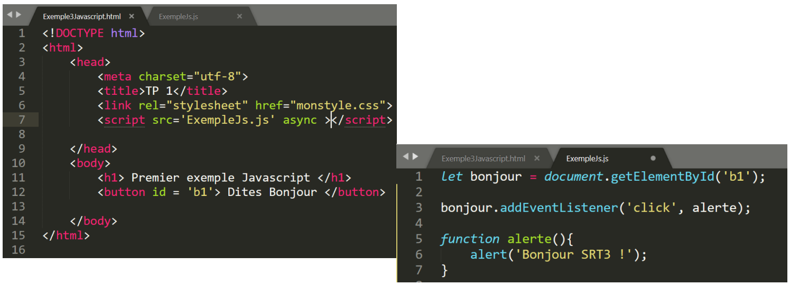
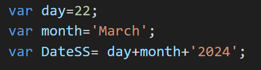

# Chapter 2 : Master the basic technologies of client-side Web development 


## <div style="color: Royalblue;"> Table of contents </div>

- HTML: presentation, DOM, structuring an html page and the notion of tags 
- CSS: presentation, selector types and responsive design
- JavaScript basics: Basic concepts, functions and arrays, callback Functions, - events and DOM manipulation
- Advanced JavaScript: Objects, JSON and Storage. 

## <div style="color: Royalblue;"> Introduction </div>
##### <div style="color: Royalblue;"> Web page languages Frontend </div>

{:style="width:450px;height:300px;"}

##### <div style="color: Royalblue;"> Why learn these languages? </div>

{:style="width:600px;height:300px;"}

##### <div style="color: Royalblue;"> The W3C ! (World Wide Web Consortium)</div>

{:style="width:600px;height:180px;"}

Check your code : [https://validator.w3.org/](https://validator.w3.org/)

## <div style="color: Royalblue;"> HTML : HyperText Markup Language </div>

{:style="width:700px;height:350px;"}

**<div style="color: Royalblue;"> HTML : its versions</div>**

{:style="width:700px;height:300px;"}

**<div style="color: Royalblue;"> HTML : the basics </div>**

{:style="width:600px;height:300px;"}

**<div style="color: Royalblue;"> HTML : the Doctype </div>**

 &nbsp;`<!DOCTYPE html>` <br>
• A Doctype is a line of code used to indicate the type of your document.<br>
• It specifies the defined standards that you will use in this document.<br>
• The line of code containing the Doctype is inserted at the very beginning of the page. You can place it on the first line of your HTML document if you wish. <br>
• The Doctype should always be before the `<HTML>` tag.<br>
• For a developer, the Doctype is used to validate his pages according to the chosen W3C standards. <br>
• Its main purpose is to tell browsers how to interpret the document or web page.
• With the arrival of HTML 5, the doctype was thus simplified to the maximum: <br>

**<div style="color: Royalblue;"> Create your first web page </div>**
To create a web page, all you need to do is: <br>
- Use your favorite text editor (Visual studio code, Sublime Text or other). <br>
- Create a file with the ".html" extension and save it <br>
- Open the file you've created by double-clicking on the file icon, which by default will be your browser's icon. <br>

A web page is made up of two parts:

- The `<head>` header: general information about the page: its title, encoding (for handling special characters), etc.<br>

This information is not displayed on the page ➔ information intended for the computer<br>

- The body `<body>`: this is where the main part of the page is located; anything written here will be displayed on the screen.<br>


{:style="width:700px;height:400px;"} <br>

To execute the html page, you need to run the file: 

{:style="width:600px;height:200px;"} <br>

**<div style="color: Royalblue;"> Html: Basics </div>**

- Any open tag must be closed: `<tag> ... </tag>`
    • Example: `<html> ... </html>`
- Empty tags can be self-closing: <br>
    • Example : `<br/>`
- Nesting possible but no overlap: <br>
    • Example : <del>`<tag 1><tag 2></tag 1></tag 2>`</del>➔ `<tag 1> <tag 2> </tag 2> </tag 1>` <br>
- DOCTYPE is case-sensitive <br>
- Attributes always have a value, and the value is always enclosed in single or double quotation marks. <br>
- Attributes are separated from their value by "=". <br>
- Attributes are separated from each other by at least one blank character (space, line feed, tab). <br>

<div style="color: Red;">Note: In HTML 5, attributes are not case-sensitive, but this is not the case in XML dialects: attributes must always be written in lower case.</div>

**<div style="color: Royalblue;"> Examples of tags </div>**
 - The paragraphs: `<p> paragraph </p>` <br>
 - Go to line: `<br>` <br>
 - Titles: <br>
   &nbsp;&nbsp;• `<h1>text</h1>` : means "very, very important <br>
   &nbsp;&nbsp;• `<h2>text</h2>` : means "very important <br>
   &nbsp;&nbsp;• `<h3>text</h3>` : means " important <br>
   &nbsp;&nbsp;• `<h4>text</h4>` : means " less important <br>
   &nbsp;&nbsp;• `<h5>text</h5>` : ... </br>
   &nbsp;&nbsp;• `<h6>text</h6>` : ...<br>

{:style="width:600px;height:320px;"} <br>

to see more html elements visit this link:[more html elements](https://developer.mozilla.org/en-US/docs/Web/HTML/Element) 

**<div style="color: Royalblue;"> Html: attributes </div>**

- Attributes contain additional information about the element, but do not appear in the actual content. <br>
- The class attribute gives the element an identifying name that will be used for it <br>
- Several elements can belong to the same class.<br>

{:style="width:300px;height:100px;"} <br>

**<div style="color: Royalblue;">Html: images </div>**

{:style="width:600px;height:150px;"} <br>

There are several attributes that can be defined: <br>
&nbsp;&nbsp;  - src source image [URI or file name] <br>
&nbsp;&nbsp;  - alt in this attribute, you specify a descriptive text for users who can't see the image (e.g. something went wrong and the image isn't displayed). <br>
&nbsp;&nbsp;  - height in pixels <br>
&nbsp;&nbsp;  - width in pixels <br>
&nbsp;&nbsp;  - align to the left, right, top, middle or bottom <br>

**<div style="color: Royalblue;">Html: Lists and links</div>**
Lists: <br>
&nbsp;&nbsp;  - Unordered lists `<ul> + <li>` <br>
&nbsp;&nbsp;  - Ordered lists `<ol> + <li>`<br>

{:style="width:800px;height:500px;"} <br>

Links: <br>

{:style="width:500px;height:200px;"} <br>

**<div style="color: Royalblue;">Html: Tables</div>**

{:style="width:570px;height:500px;"} <br>

**<div style="color: Royalblue;">Html: Header and footer tags</div>**

- `<header>`: represents introductive content, generally a group of introductive or navigator content. It may contain title elements, but also other elements such as a logo, a search form, the author's name, etc. <br>
{:style="width:400px;height:120px;"} 

- `<footer>`: represents the footer of the nearest section or section root. An element usually contains information about the section's author, copyright data or links to other related documents.<br>
{:style="width:200px;height:80px;"} 

**<div style="color: Royalblue;">Html: « article » , « section », « nav » and « div » tags</div>**

- `<article>`: represents an autonomous composition in a document, page, application or site, intended for independent distribution or reuse.<br>
 Rq: A given document may contain several articles. <br>
- `<section>`: represents a generic section of a document. Rq: a section generally begins with a title <br>
- `<nav>`: represents a section of a page with links to other pages or fragments of that page. <br>
- `<div>`:(or division) is the generic container for stream content. As a "pure" container, the element represents nothing in itself. Instead, it's used to group content together so that it can be easily styled using the class or id attributes, to mark a section of a document as being written in a different language (using the lang attribute), and so on. Rq: This tag will be interesting to study when you discover CSS.<br>
{:style="width:600px;height:500px;"} 

**<div style="color: Royalblue;">Html: Multimedia tags </div>**

- `<video>` : integrates a video player directly into the page, with Play and Pause buttons and a progress bar, volume control...<br>
{:style="width:200px;height:100px;"} 

- `<audio>`: same as the video tag, but for audio. Each browser uses its own design to style its player. But it's also possible to create your own design, if you want a uniform look.<br>
{:style="width:200px;height:100px;"} 

- `<canvas>`:the most exciting tag of all!!! It's a form of surface on which shapes can be traced and animated. It offers revolutionary possibilities for video game development. Coupled with WebGL for 3D graphics rendering, impressive results can be achieved within the browser itself.<br>
{:style="width:200px;height:100px;"} 

**<div style="color: Royalblue;">Html: Forms </div>**

- `<form>`: represents a form, i.e. a section of a document containing interactive controls enabling a user to provide information.<br>
- `<input>`: used to create an interactive control in a web form that allows the user to enter data. The element's input options and behavior are highly dependent on the value specified in its type attribute and its other attributes.<br>
{:style="width:500px;height:300px;"} <br>
To see more of the tags used in forms, please visit: [tags for forms](https://developer.mozilla.org/en-US/docs/Learn/Forms)

## <div style="color: Royalblue;"> CSS: Cascading Style Sheet </div>
**<div style="color: Royalblue;"> CSS: Presentation {:style="width:200px;height:200px;"} <br></div>**


- Introduced in 1996<br>
- CSS 1 → CSS 2.0 → CSS 2.1 → CSS 3 <br>
- A language that complements HTML <br>
- A langage that manages the layout of your site <br>
- A langage that allows you to choose colors, selects fonts, defines text size, borders, background, etc. <br>
- A langage that Allows you to lay out your site; menu layout, width, header position ...

{:style="width:600px;height:300px;"}

**<div style="color: Royalblue;"> CSS: Example </div>**
{:style="width:600px;height:300px;"}

**<div style="color: Royalblue;"> CSS: Syntax </div>**
{:style="width:600px;height:300px;"}

- Selector: the element(s) to be styled <br>
- Declaration: a single rule specifying the properties of the element you want to style
- Properties: the ways in which you can style a given html element
- Property value; choose one of the many possible appearances for a given property

{:style="width:400px;height:140px;"}

- Each rule element must be surrounded by braces { }.
- In each declaration, use a colon ":" to separate properties from their values.
- Use a semicolon ";" to separate each declaration from the next.

You can also select multiple elements and apply a single set of rules to each of them. Separate multiple selectors with commas. For example: <br>
{:style="width:500px;height:150px;"}

**<div style="color: Royalblue;"> Some CSS properties </div>**
{:style="width:600px;height:300px;"}

### <div style="color: Royalblue;"> CSS 3 </div> ###

- All new features since CSS 2.1
- Enriches the style sheets:<br>
            - New effects,<br>
            - New selectors,<br>
            - New ways to specify colors,<br>
            - Detection of the user's device,<br>
- Calculations in a style sheet...
- Rounded borders
- Vendor prefixes
- Visual effects
- [Selectors](https://developer.mozilla.org/en/docs/Web/CSS/Reference)

**<div style="color: Royalblue;"> CSS : selector </div>**

A type selector targets an HTML element (a tag) in your document:<br>

- [Type selector](https://developer.mozilla.org/en-US/docs/Learn/CSS/Building_blocks/Selectors/Type_Class_and_ID_Selectors) : you just have to specify the name of the html tag

- [Universal selector ( * )](https://developer.mozilla.org/en-US/docs/Learn/CSS/Building_blocks/Selectors/Type_Class_and_ID_Selectors#le_s%C3%A9lecteur_universel): allows to select all the document

- [Class selector](https://developer.mozilla.org/en-US/docs/Learn/CSS/Building_blocks/Selectors/Type_Class_and_ID_Selectors#s%C3%A9lecteurs_de_classe) : start with a point (.)

    - Select any element to which this class is applied<br>

    - Select elements of a given type<br>

    - Select an element belonging to several classes<br>

- [ID selector](https://developer.mozilla.org/en-US/docs/Learn/CSS/Building_blocks/Selectors/Type_Class_and_ID_Selectors#s%C3%A9lecteurs_de_classe): start with (#) used in the same way as a class selector but an ID cannot have a duplicate in the same document

- [Attribute selector](https://developer.mozilla.org/en-US/docs/Learn/CSS/Building_blocks/Selectors/Attribute_selectors): matches elements based on the presence or value of a given attribute.

**<div style="color: Royalblue;"> CSS : Cascade, inheritance and specificity </div>**

**Objectives**: Control how CSS is applied to HTML and how conflicts are resolved

**Why**: A CSS that does not apply as wanted to an element!

&rarr; Creation of several rules to apply on the same element

**Solution** : Creation of several rules to be applied on the same element
voici comment faire une structure html. 

**<div style="color: Royalblue;"> Cascade </div>**

Order of appearance of the rules in the CSS 

&rarr; 2 rules with the same specificity: the last one will be applied

**Example: Color will have the final value Blue**

{:style="width:550px;height:350px;"}

**<div style="color: Royalblue;"> Specificity </div>**

Specificity measures how precise the selection is:

- **Low specificity selector**: targets all elements of a given type: low rating

- **More specific selector**: only targets elements with the class attribute of the specified value: high rating

{:style="width:500px;height:300px;"}

**<div style="color: Royalblue;">Inheritance</div>**

Some values for a CSS property are passed from parent elements to their children, others
are not.

{:style="width:500px;height:350px;"}

**<div style="color: Red;">Warning: Properties such as width, margins, fill, and borders are not inherited.</div>**

**<div style="color: Royalblue;">Inheritance: properties</div>**
<div style="color: black;">
    - Inherit : inheritance enabled<br>
    - Initial : default value<br>
    - unset : reset the property to its natural value<br></div>

{:style="width:600px;height:350px;"}


## <div style="color: Royalblue;">Responsive Design</div> ##

- A responsive interface adapts to the size of the screen, while remaining comfortable to use.<br>
=> Need to design websites which can be viewed from any terminal, desktop PC or cell phone, with a comparable comfort of use.<br>

{:style="width:400px;height:300px;"}

**<div style="color: Royalblue;">Responsive: the key steps</div>**

- Responsive web design : <br>
  1st step : **device** : take the ring road into account => viewport.<br>
  2d step : mobile first : css for mobile first => min-width, max-width, min-height, max-height<br>
  3rd step : media query : define breakpoint <br>
{:style="width:600px;height:350px;"}

**<div style="color: Royalblue;">Step 1 : Viewport</div>**

The viewport declaration must be placed in ALL HTML pages of the website, in
the head section.
{:style="width:500px;height:200px;"}

**<div style="color: Royalblue;">Step 2: Define dimensions and set limits</div>**

- Define dimensions in relative units: For margins, element dimensions, etc. Relative
length units specify a length relative to another length property. <br>The most commonly
used unit is the percentage. It is relative to the parent element.<br>
&rarr; So all dimensions are proportional to those of the screen
- Set limits: 4 properties allow to set min-width, max-width, min-height and max-height
limits <br>
&rarr; Unlike the other dimensions, these values will be defined in absolute units
(e.g. pixels)

## <div style="color: Royalblue;">Media query</div>##

The **media queries** allow, while remaining on a screentype terminal, to filter styles according to the size of this screen.<br>
**\@media** applies CSS rules to a specific device. By using this attribute, it is therefore possible to define specific layouts for each device: screen, printer, smartphone, etc.

{:style="width:600px;height:450px;"}

## <div style="color: Royalblue;">Flexbox</div>##

- **Flexbox**, or flexible boxes, is a new property introduced in CSS3.
They make adaptive design much easier.
{:style="width:600px;height:200px;"}

- With **flex-wrap**, if the elements are too big to fit on one line, they will move to another line

{:style="width:600px;height:200px;"}

- **Flex-flow** : shorthand property that specifies the direction of a flex container, as
well as its wrapping behavior.

{:style="width:600px;height:200px;"}

## <div style="color: Royalblue;"> Javascript Basics </div>

<div style="color: Orange;"> - Html : creating content </div>
<div style="color: Orange;"> - Css : organizing content </div>
<div style="color: Orange;"> - Javascript : to interact with the user </div>

**Javascript** : what is it? <br>

- Abbreviated as "JS", it is a lightweight scripting language, mainly known as the scripting language for web pages.

- It is a dynamic language;

- The code is mainly interpreted by the client browser (interpretation depending on the browser type and version).

- Event-driven language (association of actions to events triggered by the user (mouseover, click, keyboard input, etc.).

- Also used in many non-browser environments such as Node.js, Apache CouchDB and
even Adobe Acrobat.

**<div style="color: Royalblue;"> Javascript at the beginning! </div>**

The term JavaScript has remained in the common vocabulary, but in fact it is ECMAScript

- Invented in 1995 by Brendan Eich for Netscape and its browser,

- ECMAScript specification validated by Ecma International in June 1997 ECMA 262 standard

- ECMAScript standardized in its version 5 in December 2009

- ES 2015 was released in June 2015. This version was successively called ECMAScript Harmony, ECMAScript 6 and ECMAScript 2015

**<div style="color: Royalblue;"> Advantages and disadvantages </div>**

{:style="width:800px;height:400px;"}

**<div style="color: Royalblue;"> Where to put the Javascript? </div>**

**3 options :**</br>

1. In the opening tag of an HTML element:<br>
{:style="width:400px;height:150px;"}
2. In a script element, within an HTML page: <br>
{:style="width:600px;height:300px;"}
3. In a separate file containing only JavaScript and with the extension .js:<br>
{:style="width:600px;height:300px;"}
**<div style="color: Royalblue;"> Javascript : syntax </div>**
1. JavaScript is case sensitive.<br>
2. In JavaScript, statements are separated by semicolons.<br>
3. If there are multiple statements on a single line, then they must be
separated by a semicolon.<br>
4. Comments:<br>
{:style="width:300px;height:120px;"}
**<div style="color: Royalblue;"> Javascript : Declaration and initialization of variables</div>**

To declare a variable in JavaScript, two options:</br>
- The **« var »** keyword : declare a variable and possibly initialize its value </br>
- The **« let »** keyword : allows you to declare variables that are limited to the scope of a block statement, or expression on which it is used, unlike the var keyword, which declares a variable globally, or locally to an entire function regardless of block scope.</br>
one of these keywords must be followed by the name we want to give to our variable.</br>
It is also possible to define a constant using the keyword « const »<br>
{:style="width:300px;height:80px;"}

**<div style="color: Red;">Notes :</div>**
1. A variable declared using the var or let statement without a defined initial value will be worth **undefined** </br>
2. Variable names are called **identifiers**</br>
3. A JavaScript identifier must begin with a letter, an underscore `(_)`, or a dollar sign `($)`</br>
**<div style="color: Royalblue;">let vs var</div>**
{:style="width:500px;height:300px;"}

**<div style="color: Royalblue;">Javascript: operators, concatenation</div>**

- Operators: <br>
`+, -, /, *, %, == (values), === (values and types), !=(value), !==(values or types), <, >,` etc <br>
{:style="width:200px;height:100px;"}

- Concatenation: <br>
{:style="width:300px;height:100px;"}

- Display: <br>
{:style="width:300px;height:100px;"}

**<div style="color: Royalblue;">Javascript: Conditional structure</div>**

- Simple conditional structures:

```js linenums="1" 
  var x=1;
   if(x>1)
   {alert('The value of x is greater than 1');
   }else{
    alert('The value of x is less than 1')
   }

```

- Multiple conditional structure: 

```js linenums="1" 
var =1 
if(x>1)
   {alert('The value of x is greater than 1');
   }else if(x==1){
    alert('The value of x is equal to 1')
   }else{
    alert('The value of x is less than 1')
   }

switch(x){
    case 0: alert('The value of x is greater than 1');
    break;
    case 1: alert('The value of x is equal to 1');
    break;
    case 2:alert('The value of x is less than 1');
    break;
    default: alert('I dont know!');
}

``` 
**<div style="color: Royalblue;">Javascript: Loop structure</div>**


```js linenums="1"
//while loop
var x=0;
while(x<10){
    x++;
}

//do while loop
do{
    x++;
}while(x<10);

//For loop
for(let i=0;i<10;i++)
{
    x++;
}
```
**<div style="color: Royalblue;">Javascript:function</div>**

- You can create a function using the obvious keyword **"function"** <br>

```js linenums="1"
function random_integer(){
    return Math.random()*100;
}

function Multiplication(number1,number2)
{
    return numbre1+ '*' +numbre2+ '=' + (numbre1+number2);
}
```
- A function can be anonymous(not have a corresponding name): <br>

```js linenums="1"
var carré=function(n){
    return n*n;
}

var x=carré(4);
```

- **Notes**: The declaration of a function can be made after the call

**<div style="color: Royalblue;">Javascript:events</div>**

- JavaScript = reactive language &rarr; like a sequence of events that occur in
time
- User interaction is managed through events
- Event = action or event that occurs in the system and that the system
informs you about in order to respond to
- Events are usually HTML attribute names, the content of these attributes will be JavaScript.
- In general, JavaScript makes it possible to link a JavaScript instruction with
each event: either via the call to a basic JavaScript function, or via the call
to one of our own procedures.

**<div style="color: Royalblue;">Javascript:event detection</div>**
 
{:style="width:600px;height:250px;"}

**<div style="color: Royalblue;">Javascript : functions used with a user action</div>**

Some examples : <br>
- alert : opens a window with a given message,<br>
- modifier window.location to go to another page,<br>
- document.write: writes a given text,<br>
- setTimeout et setInterval allow respectively to delay and to repeat an instruction;<br>
- focus : allows to activate an element of the page (like the box to be filled in a form), blur to deactivate it.<br>

```js linenums="1"
//trigger immediate alert (alert)
<button onclikc="alert('Hi!')">click here!</button>

//alert triggered in half a second(setTimeout)
<button onclick="setTimeout('alert(\'Surprise!\')',500)">click here!</button>

//repeat every 5 seconds (setInterval)
var clock_id=setInterval('alert(\'hi hi !\');',5000);

clearInterval(clock_id);//end of repeat
```
**<div style="color: Royalblue;">DOM : Document Object Model</div>**

- The DOM represents HTML as a structure of tree structure of tags.

{:style="width:500px;height:200px;"}

- DOM: structured representation of the document in the form of a tree.
- DOM: defines how the structure can be manipulated.
- JavaScript interacts with the page via the DOM structure accessible via a variable called "document".
- DOM: accessing one or more elements
- To access an element by its " id ", use " GetElementById ".
- If an HTML element has an "id", a variable is created for it.

**<div style="color: Royalblue;">DOM : Access to the element</div>**

To access a DOM element, you can use:<br>
- By its **id** attribute<br>
- By its **class** attribute<br>
- By its tag<br>
- By a **CSS** selector<br>
- By its **name** attribute<br>

{:style="width:500px;height:170px;"}

## <div style="color: Royalblue;">Javascript: Synchronous Vs Asynchronous </div> ##

{:style="width:700px;height:200px;"}


**<div style="color: Royalblue;">Asynchronous in Javascript</div>**

- In computer science, two operations are said to be synchronous when the second one waits for the first one to finish its work before starting (dependency)</br>
-  Two operations are said to be asynchronous in computer science when they are independent, i.e. when the second operation does not need to wait for the first to finish before starting.<br>
-  In JavaScript, each line of code is executed synchronously, but it is possible to request to execute code asynchronously i.e. actions can be executed independently of the main execution flow <br>
- In JavaScript, asynchronous operations are put in queues that will execute after the main thread has finished its operations. They do not block the execution of the rest of the JavaScript code <br>
-  Example of asynchronous functions setTimeout setInterval setImmediate <br>

- The function setTimeout: this is the most common function when you want to execute
asynchronous code without blocking the current execution thread. <br>
&rarr; This function takes 2 parameters:
  - The function to be executed asynchronously (which will be added to the event loop queue) ;
  - The time delay, in milliseconds, before executing this function.

```js linenums="1"
setTimeout(function(){
    console.log("I'm here!")
},5000);
console.log("Where are you?");
//The message "where are you?"" will display before "I'm here!",which will only be displayed after 5 seconds
```
**<div style="color: Royalblue;">Callback function</div>**

- A **"callback"** function is a function passed as an argument to an asynchronous function and which will be called at the end of the execution of the latter.

```js linenums="1"
//function 
function greet(name, callback)
{
    console.log('Hi'+ ' '+ name);
    callback();
}
//callback function
function callMe(){
    console.log('I am callback function');
}

//passing function as an argument
greet('Efrei', callMe);
```
&rarr; When we pass a function as a
parameter, we just give its name,
without the parentheses (the
presence of parentheses causes a
function call) <br>
<div style="color: red;"> Rq: This can turn into a callback hell if you
have several callbacks where each one
requires the result of the previous
operation</div>

**<div style="color: Royalblue;">The Promise object</div>**

- A promise is an object that is returned and to which callbacks are attached rather than passing callbacks to a function.<br>
- The "Promise" object which represents the completion or failure of an asynchronous operation.<br>
➢ A promise is an object that is returned and to which callbacks are attached, rather than passing callbacks to a function.<br>
➢ A promise in JavaScript is an object that represents the state of an asynchronous operation<br>
➢ An asynchronous operation can be in one of the following states : <br>
      • Operation in progress (not completed)<br>
      • Operation successfully completed (promise resolved)<br>
      • Operation completed or more precisely stopped after a failure (promise rejected)<br>

```js linenums="1"
const promesse=new Promise((resolde,reject))=>{
    //asynchrone task to realise
    //call resolve function if the promise is resolved
    //or
    //call reject function if the promise is rejected
}
```
**<div style="color: Royalblue;">The Anonymous function and arrow function</div>**

- An arrowed function allows to have a shorter syntax
- It is possible to define a function directly inside another function

{:style="width:600px;height:250px;"}

**<div style="color: Royalblue;">Fetch function</div>** <br>

In JavaScript, the `fetch()` function is used to make HTTP requests to resources, usually web APIs, and retrieve the data. It is Promise-based, meaning that it can process results asynchronously, using the `.then()` and 
`.catch()` methods.

```js linenums="1"
fetch('https://api.example.com/data')
  .then(response => {
    if (!response.ok) {
      throw new Error('Erreur HTTP, statut ' + response.status);
    }
    return response.json();
  })
  .then(data => {
    console.log('DATA getted with success :', data);
    // Faire quelque chose avec les données ici
  })
  .catch(error => {
    console.error('an error has occurred :', error);
  })
```

**<div style="color: Royalblue;">The scope</div>**

- Scope is often referred to when talking about global and local variables

```js linenums="1"
function mafonction(){
    const terme='secret';
    return 'Hello everybody';
}
console.log(mafonction());
console.log(terme);
```
- The variable myfunction of type function has a global scope to the script <br>
- The term variable is defined in the secret function and is therefore not accessible outside the scope of the function<br>
- Conversely, what is defined outside a function is accessible inside a function<br>


## <div style="color: Royalblue;">Objects in JavaScript </div>##

- Objects in JavaScript :<br>
  ➢ Javascript uses the "objects" paradigm <br>
  ➢ A Javascript object is an entity in itself that has properties and a type <br>
  ➢ The JavaScript environment provides native (predefined) objects (Date, String, Math, etc...), but it is possible to build new objects <br>
  ➢ An object is defined with 3 elements :<br>
       - its constructor,<br>
       - its properties <br>
       - its methods (functions specific to the object) <br>

- To see more about object creation, please visit this link : [https://developer.mozilla.org/en-US/docs/Web/JavaScript/Reference/Global_Objects/Object](https://developer.mozilla.org/en-US/docs/Web/JavaScript/Reference/Global_Objects/Object)

- Example 1 : creation of an object called "Person" <br>

```js linenums="1"
// Definition of the object person
let Person = {
  name: "Zouhour",
  surname: "Guiras",
  age: 33,

  // method to display person information
  DisplayDetails: function() {
    console.log("name:", this.name);
    console.log("Surname:", this.surname);
    console.log("Age:", this.age);
  },

  // Method to change the name
  changeName: function(newName) {
    this.name = newName;
  }
};
// Display initial person information
console.log("Display initial person information");
Person.DisplayDetails();

// Change person name
Person.changeName("Jane");

// Display new person information
console.log("\n updated person information");
Personne.DisplayDetails();
```

- Example 2: Manage a date object <br>


```js linenums="1"
// Create an object date which presents the current date. 
let currentDate = new Date();

// display current date
console.log("Current Date :", currentDate);

// get the year
let year = currentDate.getFullYear();
console.log("current year :", year);

// get month (0-11)
let month = currentDate.getMonth();
console.log("Current month:", month);

// get day of the month (1-31)
let day = currentDate.getDate();
console.log("Current day of the month :", day);

// get day of the week (0-6)
let dayweek = day.getDay();
console.log("Current day of the week :", day week);

// get hour
let hour = currentDate.getHours();
console.log("Current hour :", hour);

// get minutes
let minutes = currentDate.getMinutes();
console.log("Current minutes:", minutes);

// get seconds
let seconds = currentDate.getSeconds();
console.log("Current Seconds :", seconds);

// get milliseconds
let milliseconds = currentDate.getMilliseconds();
console.log("Current millisecondes :", milliseconds);
```

## <div style="color: Royalblue;">The iterable object : Array</div>##

- Object used to create arrays
- Array objects have methods to browse and modify their contents
- To see the list of methods that can be used to manipulate arrays, please visit this link : [https://developer.mozilla.org/fr/docs/Web/JavaScript/Reference/Global_Objects/Array](https://developer.mozilla.org/fr/docs/Web/JavaScript/Reference/Global_Objects/Array) <br>


```js linenums="1"
let students=['Jean','Paul','David'];
console.log(students.length);
// it will display 3
// The access to an element of the array is done via its index 
let first=students[0];
//Jean
let second=students[2];
//David
//Loop on the content of the table
students.forEach(function(item, index, array)
{
    console.log(item,index);

});
// Jean 0
// Paul 1
// David 2

//Add to end, remove from start/end an element 
let new=students.push('Zouhour');
let last=students.pop();
let first=students.shift();
```
## <div style="color: Royalblue;">The JSON format</div>##

- JSON : JavaScript Object Notation
- Standard format used for representing structured data in a way similar to JavaScript objects
- Developed by Douglas Crockford
- Can be used in many other programming languages
- JSON: string that is converted into a native Javascript object (parsing)
- JS provides a global JSON object with methods to perform the conversion
- A JSON object can be stored in a file with the extension .json and the MIME Type application/
json
- Allows to prioritize data

- Example: 

```js linenums="1"
{
  "students": [
    {
      "name": "Dupont",
      "surname": "Jean",
      "age": 20
    },
    {
      "name": "Martin",
      "surname": "Marie",
      "age": 22
    },
    {
      "name": "Dubois",
      "surname": "Pierre",
      "age": 21
    }
  ]
}
```
**<div style="color: Royalblue;">The JSON object</div>**

- Objet global javascript
- Contains methods for :
     - interpreting JSON
     - converting values to JSON

&rarr; **Parse**: parse the string as JSON<br>
  • If needed, transform the produced value and its properties and return the value <br>
  • Syntaxe : `JSON.parse(texte[, revivificateur])` <br>
&rarr; **stringify**: Returns a JSON string corresponding to the specified value <br>
  • Includes some properties <br>
  • Replaces property values in a way defined by the user. <br>
  • Syntaxe : `JSON.stringify(valeur[, remplacement[, expace]])`<br>

  - Example: Suppose you have a JSON file called students.json containing the data shown above: <br>
  - To convert the content of the JSON file into a JavaScript object, use the method `JSON.parse()`<br>

```js linenums="1"
  const fs = require('fs');
  // Read the content of the JSON file
  let jsonData = fs.readFileSync('students.json', 'utf-8');
  // Convert the content of json file to an object js
  let dataObj = JSON.parse(jsonData);
  // display the different students
  console.log(dataObj); 
```

- To convert a JavaScript object into a JSON string, use the method : `JSON.stringify()`<br>

```js linenums="1"
const fs = require('fs');

// Objet JavaScript represents students
let students = [
  {
    name: "Smith",
    surname: "John",
    age: 23
  },
  {
    name: "Johnson",
    surname: "Emily",
    age: 21
  }
];

// Convertir the objet JavaScript to a string JSON
let jsonData = JSON.stringify({ students: students }, null, 2);

// write the string json into a file
fs.writeFileSync('new_students.json', jsonData, 'utf-8');
```
## <div style="color: Royalblue;">Storage</div>##

- In JavaScript, "storage" refers to the ability to store data locally in the Web browser. There are two main types of storage: **localStorage** and **sessionStorage**.<br>
- **localStorage**: localStorage enables data to be stored persistently in the browser. This means that stored data remains available even after the browser has been closed and reopened. Data stored in localStorage remains until explicitly deleted by the user or erased by the script.<br>
- **sessionStorage**: Unlike localStorage, sessionStorage stores data for the duration of a browser session. This means that data stored in sessionStorage is available as long as the browser window or tab remains open. Once the session ends (i.e. when the user closes the tab or browser), the data stored in the sessionStorage is deleted.

- Example with localStorage: <br>
```js linenums="1"
// store data in localStorage
localStorage.setItem('name', 'John');
localStorage.setItem('age', '30');

// Get data from localStorage
const nom = localStorage.getItem('name');
const age = localStorage.getItem('age');

console.log(name); // display : John
console.log(age); // display : 30

// delete data from localStorage
localStorage.removeItem('age');

// delete all data from localStorage
localStorage.clear();
```
- Example with sessionStorage: <br>

```js linenums="1"
// store data in sessionStorage
sessionStorage.setItem('name', 'Alice');
sessionStorage.setItem('city', 'Paris');

// get data from sessionStorage
const nom = sessionStorage.getItem('name');
const ville = sessionStorage.getItem('city');

console.log(name); // display : Alice
console.log(city); // display : Paris

// delete data from sessionStorage
sessionStorage.removeItem('city');

// delete all data from sessionStorage
sessionStorage.clear();
```

- Rq: It's important to note that localStorage and sessionStorage are limited in terms of storage size (typically a few megabytes) and should not be used to store sensitive data, such as credentials or personal information, as these are accessible in JavaScript and may be subject to security attacks.

## <div style="color: Royalblue;">Practical work</div>##

- Check that groups have been created and projects selected correctly
- You can now start creating your web pages. <br>

Start by creating the home page of your site (home page of a restaurant, museum, school or travel agency). <br>


You can then move on to the page where you propose your offers, for example: <br>


- the menu for the restaurant <br>
- paintings and status for the museum, <br>
- excursion offers for the travel agency <br>
- departments, staff, classes for the school <br>

Once you've finished these two pages, you can create other pages such as the user login page, the about us page...


