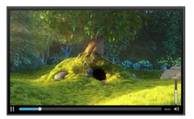
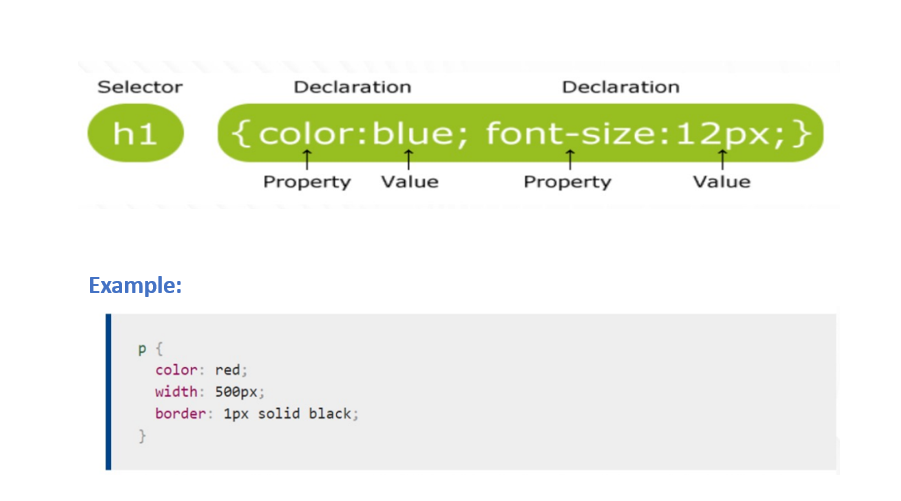
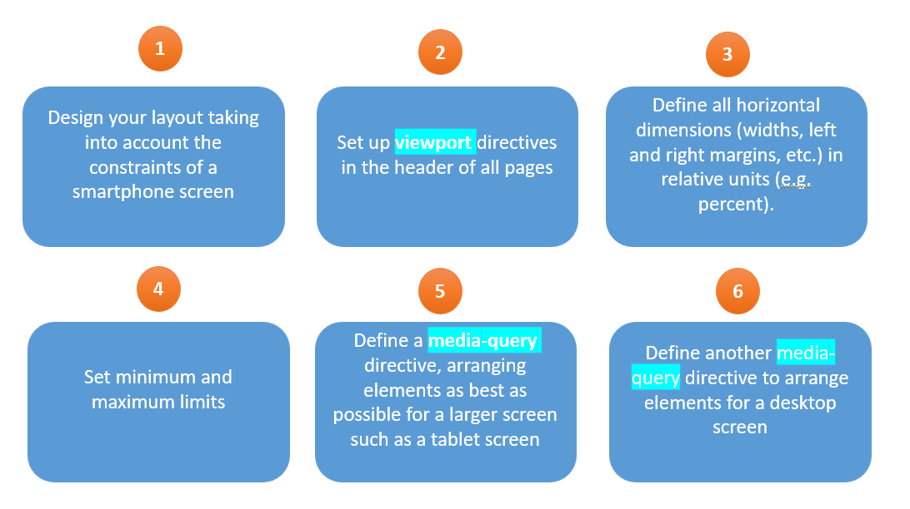

# Chapter 2 : Master the basic technologies of client-side Web development 

## <div style="color: Royalblue;"> Table of contents </div>

- HTML: presentation, DOM, structuring an html page and the notion of tags 
- CSS: presentation, selector types and responsive design
- JavaScript basics: Basic concepts, functions and arrays, callback Functions, - events and DOM manipulation
- Advanced JavaScript: Objects, JSON and Storage. 

## <div style="color: Royalblue;"> Introduction </div>
##### <div style="color: Royalblue;"> Web page languages Frontend </div>

{:style="width:450px;height:300px;"}

##### <div style="color: Royalblue;"> Why learn these languages? </div>

{:style="width:600px;height:300px;"}

##### <div style="color: Royalblue;"> The W3C ! (World Wide Web Consortium)</div>

{:style="width:600px;height:180px;"}

Check your code : [https://validator.w3.org/](https://validator.w3.org/)

## <div style="color: Royalblue;"> HTML : HyperText Markup Language </div>

{:style="width:700px;height:350px;"}

**<div style="color: Royalblue;"> HTML : its versions</div>**

{:style="width:700px;height:300px;"}

**<div style="color: Royalblue;"> HTML : the basics </div>**

{:style="width:600px;height:300px;"}

**<div style="color: Royalblue;"> HTML : the Doctype </div>**

 &nbsp;`<!DOCTYPE html>` <br>
• A Doctype is a line of code used to indicate the type of your document.<br>
• It specifies the defined standards that you will use in this document.<br>
• The line of code containing the Doctype is inserted at the very beginning of the page. You can place it on the first line of your HTML document if you wish. <br>
• The Doctype should always be before the `<HTML>` tag.<br>
• For a developer, the Doctype is used to validate his pages according to the chosen W3C standards. <br>
• Its main purpose is to tell browsers how to interpret the document - or web page.With the arrival of HTML 5, the doctype was thus simplified to the maximum: <br>

**<div style="color: Royalblue;"> Create your first web page </div>**
To create a web page, all you need to do is: <br>
- Use your favorite text editor (Visual studio code, Sublime Text or other). <br>
- Create a file with the ".html" extension and save it <br>
- Open the file you've created by double-clicking on the file icon, which by default will be your browser's icon. <br>

A web page is made up of two parts:

- The `<head>` header: general information about the page: its title, encoding (for handling special characters), etc.<br>

This information is not displayed on the page ➔ information intended for the computer<br>

- The body `<body>`: this is where the main part of the page is located; anything written here will be displayed on the screen.<br>


{:style="width:700px;height:400px;"} <br>

To execute the html page, you need to run the file: 

{:style="width:600px;height:200px;"} <br>

**<div style="color: Royalblue;"> Html: Basics </div>**

- Any open tag must be closed: `<tag> ... </tag>`
    • Example: `<html> ... </html>`
- Empty tags can be self-closing:
    • Example : `<br/>`
- Nesting possible but no overlap: <br>
    • Example : <del>`<tag 1><tag 2></tag 1></tag 2>`</del>➔ `<tag 1> <tag 2> </tag 2> </tag 1>` <br>
- DOCTYPE is case-sensitive <br>
- Attributes always have a value, and the value is always enclosed in single or double quotation marks. <br>
- Attributes are separated from their value by "=". <br>
- Attributes are separated from each other by at least one blank character (space, line feed, tab). <br>

<div style="color: Red;">Note: In HTML 5, attributes are not case-sensitive, but this is not the case in XML dialects: attributes must always be written in lower case.</div>

**<div style="color: Royalblue;"> Examples of tags </div>**
 - The paragraphs: `<p> paragraph </p>` <br>
 - Go to line: `<br>` <br>
 - Titles: <br>
   &nbsp;&nbsp;• `<h1>text</h1>` : means "very, very important <br>
   &nbsp;&nbsp;• `<h2>text</h2>` : means "very important <br>
   &nbsp;&nbsp;• `<h3>text</h3>` : means " important <br>
   &nbsp;&nbsp;• `<h4>text</h4>` : means " less important <br>
   &nbsp;&nbsp;• `<h5>text</h5>` : ... </br>
   &nbsp;&nbsp;• `<h6>text</h6>` : ...<br>

{:style="width:600px;height:320px;"} <br>

to see more html elements visit this link:[more html elements](https://developer.mozilla.org/en-US/docs/Web/HTML/Element) 

**<div style="color: Royalblue;"> Html: attributes </div>**

- Attributes contain additional information about the element, but do not appear in the actual content. <br>
- The class attribute gives the element an identifying name that will be used for it <br>
- Several elements can belong to the same class.<br>

{:style="width:300px;height:100px;"} <br>

**<div style="color: Royalblue;">Html: images </div>**

{:style="width:600px;height:150px;"} <br>

There are several attributes that can be defined: <br>
&nbsp;&nbsp;  - src source image [URI or file name] alt <br>
&nbsp;&nbsp;  - alt in this attribute, you specify a descriptive text for users who can't see the image (e.g. something went wrong and the image isn't displayed). <br>
&nbsp;&nbsp;  - height in pixels <br>
&nbsp;&nbsp;  - width in pixels <br>
&nbsp;&nbsp;  - align to the left, right, top, middle or bottom <br>

**<div style="color: Royalblue;">Html: Lists and links</div>**
Lists: <br>
&nbsp;&nbsp;  - Unordered lists `<ul> + <li>` <br>
&nbsp;&nbsp;  - Ordered lists `<ol> + <li>`<br>

{:style="width:600px;height:350px;"} <br>

Links: <br>

{:style="width:500px;height:200px;"} <br>

**<div style="color: Royalblue;">Html: Tables</div>**

{:style="width:570px;height:400px;"} <br>

**<div style="color: Royalblue;">Html: Header and footer tags</div>**

- `<header>`: represents introductive content, generally a group of introductive or navigator content. It may contain title elements, but also other elements such as a logo, a search form, the author's name, etc. <br>
{:style="width:400px;height:120px;"} 

- `<footer>`: represents the footer of the nearest section or section root. An element usually contains information about the section's author, copyright data or links to other related documents.<br>
{:style="width:200px;height:80px;"} 

**<div style="color: Royalblue;">Html: « article » , « section », « nav » and « div » tags</div>**

- `<article>`: represents an autonomous composition in a document, page, application or site, intended for independent distribution or reuse.<br>
 Rq: A given document may contain several articles. <br>
- `<section>`: represents a generic section of a document. Rq: a section generally begins with a title <br>
- `<nav>`: represents a section of a page with links to other pages or fragments of that page. <br>
- `<div>`:(or division) is the generic container for stream content. As a "pure" container, the element represents nothing in itself. Instead, it's used to group content together so that it can be easily styled using the class or id attributes, to mark a section of a document as being written in a different language (using the lang attribute), and so on. Rq: This tag will be interesting to study when you discover CSS.<br>
{:style="width:500px;height:450px;"} 

**<div style="color: Royalblue;">Html: Multimedia tags </div>**

- `<video>` : integrates a video player directly into the page, with Play and Pause buttons and a progress bar, volume control...<br>
{:style="width:200px;height:100px;"} 

- `<audio>`: same as the video tag, but for audio. Each browser uses its own design to style its player. But it's also possible to create your own design, if you want a uniform look.<br>
{:style="width:200px;height:100px;"} 

- `<canvas>`:the most exciting tag of all!!! It's a form of surface on which shapes can be traced and animated. It offers revolutionary possibilities for video game development. Coupled with WebGL for 3D graphics rendering, impressive results can be achieved within the browser itself.<br>
{:style="width:200px;height:100px;"} 

**<div style="color: Royalblue;">Html: Forms </div>**

- `<form>`: represents a form, i.e. a section of a document containing interactive controls enabling a user to provide information.<br>
- `<input>`: used to create an interactive control in a web form that allows the user to enter data. The element's input options and behavior are highly dependent on the value specified in its type attribute and its other attributes.<br>
{:style="width:500px;height:300px;"} <br>
To see more of the tags used in forms, please visit: [tags for forms](https://developer.mozilla.org/en-US/docs/Learn/Forms)

## <div style="color: Royalblue;"> CSS: Cascading Style Sheet </div>
**<div style="color: Royalblue;"> CSS: Presentation {:style="width:200px;height:200px;"} <br></div>**


- Introduced in 1996<br>
- CSS 1 → CSS 2.0 → CSS 2.1 → CSS 3 <br>
- A language that complements HTML <br>
- A langage that manages the layout of your site <br>
- A langage that allows you to choose colors, selects fonts, defines text size, borders, background, etc. <br>
- A langage that Allows you to lay out your site; menu layout, width, header position ...

{:style="width:600px;height:300px;"}

**<div style="color: Royalblue;"> CSS: Example </div>**
{:style="width:600px;height:300px;"}

**<div style="color: Royalblue;"> CSS: Syntax </div>**
{:style="width:600px;height:300px;"}

- Selector: the element(s) to be styled <br>
- Declaration: a single rule specifying the properties of the element you want to style
- Properties: the ways in which you can style a given html element
- Property value; choose one of the many possible appearances for a given property

{:style="width:400px;height:140px;"}

- Each rule element must be surrounded by braces { }.
- In each declaration, use a colon ":" to separate properties from their values.
- Use a semicolon ";" to separate each declaration from the next.

You can also select multiple elements and apply a single set of rules to each of them. Separate multiple selectors with commas. For example: <br>
{:style="width:300px;height:100px;"}

**<div style="color: Royalblue;"> Some CSS properties </div>**
{:style="width:600px;height:300px;"}

### <div style="color: Royalblue;"> CSS 3 </div> ###

- All new features since CSS 2.1
- Enriches the style sheets:<br>
            - New effects,<br>
            - New selectors,<br>
            - New ways to specify colors,<br>
            - Detection of the user's device,<br>
- Calculations in a style sheet...
- Rounded borders
- Vendor prefixes
- Visual effects
- [Selectors](https://developer.mozilla.org/en/docs/Web/CSS/Reference)

**<div style="color: Royalblue;"> CSS : selector </div>**

A type selector targets an HTML element (a tag) in your document:<br>

- [Type selector](https://developer.mozilla.org/en-US/docs/Learn/CSS/Building_blocks/Selectors/Type_Class_and_ID_Selectors) : you just have to specify the name of the html tag

- [Universal selector ( * )](https://developer.mozilla.org/en-US/docs/Learn/CSS/Building_blocks/Selectors/Type_Class_and_ID_Selectors#le_s%C3%A9lecteur_universel): allows to select all the document

- [Class selector](https://developer.mozilla.org/en-US/docs/Learn/CSS/Building_blocks/Selectors/Type_Class_and_ID_Selectors#s%C3%A9lecteurs_de_classe) : start with a point (.)

    - Select any element to which this class is applied<br>

    - Select elements of a given type<br>

    - Select an element belonging to several classes<br>

- [ID selector](https://developer.mozilla.org/en-US/docs/Learn/CSS/Building_blocks/Selectors/Type_Class_and_ID_Selectors#s%C3%A9lecteurs_de_classe): start with (#) used in the same way as a class selector but an ID cannot have a duplicate in the same document

- [Attribute selector](https://developer.mozilla.org/en-US/docs/Learn/CSS/Building_blocks/Selectors/Attribute_selectors): matches elements based on the presence or value of a given attribute.

**<div style="color: Royalblue;"> CSS : Cascade, inheritance and specificity </div>**

**Objectives**: Control how CSS is applied to HTML and how conflicts are resolved

**Why**: A CSS that does not apply as wanted to an element!

=> Creation of several rules to apply on the same element

**Solution** : Creation of several rules to be applied on the same element
voici comment faire une structure html. 

**<div style="color: Royalblue;"> Cascade </div>**

Order of appearance of the rules in the CSS 

=> 2 rules with the same specificity: the last one will be applied

**Example: Color will have the final value Blue**

{:style="width:550px;height:350px;"}

**<div style="color: Royalblue;"> Specificity </div>**

Specificity measures how precise the selection is:

- **Low specificity selector**: targets all elements of a given type: low rating

- **More specific selector**: only targets elements with the class attribute of the specified value: high rating

{:style="width:500px;height:300px;"}

**<div style="color: Royalblue;">Inheritance</div>**

Some values for a CSS property are passed from parent elements to their children, others
are not.

{:style="width:500px;height:350px;"}

**<div style="color: Red;">Warning: Properties such as width, margins, fill, and borders are not inherited.</div>**

**<div style="color: Royalblue;">Inheritance: properties</div>**
<div style="color: black;">
    - Inherit : inheritance enabled<br>
    - Initial : default value<br>
    - unset : reset the property to its natural value<br></div>

{:style="width:600px;height:350px;"}


## <div style="color: Royalblue;">Responsive Design</div> ##

- A responsive interface adapts to the size of the screen, while remaining comfortable to use.<br>
=> Need to design websites which can be viewed from any terminal, desktop PC or cell phone, with a comparable comfort of use.
{:style="width:400px;height:300px;"}

**<div style="color: Royalblue;">Responsive: the key steps</div>**

- Responsive web design : <br>
  1st step : **device** : take the ring road into account => viewport.<br>
  2d step : mobile first : css for mobile first => min-width, max-width, min-height, max-height<br>
  3rd step : media query : define breakpoint <br>
{:style="width:600px;height:350px;"}

**<div style="color: Royalblue;">Step 1 : Viewport</div>**

The viewport declaration must be placed in ALL HTML pages of the website, in
the head section.
{:style="width:500px;height:200px;"}

**<div style="color: Royalblue;">Step 2: Define dimensions and set limits</div>**

- Define dimensions in relative units: For margins, element dimensions, etc. Relative
length units specify a length relative to another length property. <br>The most commonly
used unit is the percentage. It is relative to the parent element.<br>
&rarr; So all dimensions are proportional to those of the screen
- Set limits: 4 properties allow to set min-width, max-width, min-height and max-height
limits <br>
&rarr; Unlike the other dimensions, these values will be defined in absolute units
(e.g. pixels)

## <div style="color: Royalblue;">Media query</div>##

The **media queries** allow, while remaining on a screentype terminal, to filter styles according to the size of this screen.<br>
**\@media** applies CSS rules to a specific device. By using this attribute, it is therefore possible to define specific layouts for each device: screen, printer, smartphone, etc.

{:style="width:250px;height:350px;"}

## <div style="color: Royalblue;">Flexbox</div>##

- **Flexbox**, or flexible boxes, is a new property introduced in CSS3.
They make adaptive design much easier.
{:style="width:600px;height:200px;"}

- With **flex-wrap**, if the elements are too big to fit on one line, they will move to another line

{:style="width:600px;height:200px;"}

- **Flex-flow** : shorthand property that specifies the direction of a flex container, as
well as its wrapping behavior.

{:style="width:600px;height:200px;"}


```
<html>
<head>
<title>
</title>
</head>
<body>
</body>
</html>
```

### Code with a specific langage

```py linenums="1" 
import tensorflow as tf
def whaterver()
 return 0
```
:smile: