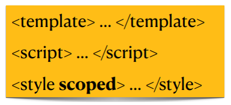

# Chapter 3: Discover a modern web framework: Vue.Js 

## <div style="color: Royalblue;"> Table of contents </div>

- Introduction to Vue.js
- Installation
- Vue instance
- Directives Vue.js
- Components
- Single File Component (SFC)
- Vue Router

## <div style="color: Royalblue;">Introduction to Vue.js</div>

**<div style="color: Royalblue;">Why use a web framework?</div>**

- Ease of development
- Saves development time
- Ease of maintenance
- Abstraction of low-level functionality

**<div style="color: Royalblue;">Presentation</div>**
{:style="width:200px;height:180px;"}</br>

- Vue3 is the default version since February 2022 (Vue3 release date: January 2020 ).</br>

- Modern framework used on a large scale.</br>

- Lean and flexible front-end Framework. </br>

- Similar to related frameworks such as Angular and React.js.</br>

- **Reactive** : vue automatically tracks changes in JavaScript state and efficiently updates the DOM when changes occur.</br>

- **Conditional rendering**: `(v-if, v-else, v-for … )`. </br>

- Many developement tools : **Vue-CLI**, **Vue-router**, **Vuex-Store**, **ESLint plugin** … </br>

**<div style="color: Royalblue;">Comparison with Angular and ReactJs</div>**

{:style="width:600px;height:250px;"}</br>

- Stars on GitHub are a measure of a project's popularity among GitHub users.  it gives a general indication of its popularity within the developer community: 

{:style="width:600px;height:250px;"}</br>

**<div style="color: Royalblue;">Single Page Application SPA</div>**

- SPAs allows users to load a web page only once. 

- A separate update of the page rather than the entire page, which allows the user to interact much more dynamically. 

- Control the launch of new pages within the same domain, no more complete page refreshes are required. 

- UX improvement.

{:style="width:600px;height:250px;"}</br>

## <div style="color: Royalblue;">Installing Vue.js</div>

- Either by including the script:
```html
<script type = "text/javascript" src="https://cdn.jsdelivr.net/npm/vue/dist/vue.js"> </script>
```

- Either by using NPM (Node Package Manager): `npm install vue` <br>

<span style="color: Red;">Rq: if you're going to use the manage npm package, you'll need to install the nodejs server:</span> [installing nodejs](https://nodejs.org/en/download)

## <div style="color: Royalblue;">Vue instance</div>

- In Vue.js, a "Vue instance" refers to a Vue application instance created using the Vue constructor. 
- A Vue instance is the entry point to any Vue.js application and represents the entire Vue application.

- A view instance is created by passing options:<br>
     1- **el**: the id of the HTML element to which we want to apply the view.<br>
     2- **data**: the data to pass to the view.<br>
     3- **Methods**: methods to call from the view <br>
     4- **Computed**: these are methods that do not change results if they are called several times<br>

```html linenums="1"
<html>
    <head>
    <script type = "text/javascript" src="https://cdn.jsdelivr.net/npm/vue/dist/vue.js"> </script>
    </head>
    <body>
        <div id="app">
            <p>{{message}}</p>
            <p>{{num}}</p>
            <button @click="randomnumber">Update</button>
            <p>{{ rand }}</p>
            <p>{{ rand }}</p>
        </div>
        <script>
            new Vue({
                el:'#app',
                data(){
                 return { 
                    message:'hello world',
                    num:0
                };
                },
                methods:{
                    randomnumber(){
                        this.num=Math.random();
                    }
                },
                computed:{
                    rand(){
                        return Math.random();
                    }
                }
            })
        </script>
    </body>
</html>

```
➔Here the data and the DOM are coupled, and everything is now declarative. If the message variable is modified in JavaScript, the template will be automatically updated.

➔There is no longer any need to interact directly with HTML (An application attaches to a single DOM element (#app in our case) and then controls it entirely).

## <div style="color: Royalblue;">Vue.js: Directives(Rendering)</div>


**<div style="color: Royalblue;">V-text : Update the textual content of the element.</div>**

- **Param** : string
- **Details** : works by setting the element's textContent property, so it will overwrite any existing content inside the element.

```html linenums="1"
<span v-text="msg"></span>
<!--same as -->
<span>{{msg}}</span>
```
**<div style="color: Royalblue;">V-html : Update the textual content of the element.</div>**

- **Param** : string
- **Details** : v-html content is inserted as raw html

```html linenums="1"
<html>
    <head>
    <script type = "text/javascript" src="https://cdn.jsdelivr.net/npm/vue/dist/vue.js"> </script>
    </head>
    <body>
        <div id="app">
            <p v-html="msg"></p>
            
        </div>
        <script>
            new Vue({
                el:'#app',
                data(){
                 return { 
                    msg:"<h1>it's a title</h1>" 
                };
                },
            })
        </script>
    </body>
</html>
```
**<div style="color: Royalblue;">V-if/ v-else-if /v-else : Conditionally render a template element or fragment based on whether the expression value is true.</div>**

- **Param** : condition
- **Details** : check if the parameter content is true
```html linenums="1"
<html>
    <head>
    <script type = "text/javascript" src="https://cdn.jsdelivr.net/npm/vue/dist/vue.js"> </script>
    </head>
    <body>
        <div id="app">
        <div v-if="type=='A'">
          A
        </div>
        <div v-if="type=='B'">
          B
        </div>
        <div v-if="type=='C'">
          C
        </div>
        <div else>
          Not A/B/C
        </div>
        </div>
        <script>
            new Vue({
                el:'#app',
                data(){
                 return { 
                    type="Z"
                };
                },
            })
        </script>
    </body>
</html>
```

**<div style="color: Royalblue;">V-on : attach an event listener to an element</div>**
- **Param** : method
- **Details** : The type of event is indicated by the argument. The expression can be a method name or an inline statement

```html linenums="1"
<!--method handler-->
<button v-on:click="doThis">click</button>

<!--dynamic event-->
<button v-on:[event]="doThis">click</button>

<!--inline statement-->
<button v-on:click="doThis('hello',$event)">click</button>

<!--shorthand-->
<button @click="doThis">click</button>

<!--shorthand dynamic event-->
<button @[event]="doThis">click</button>

<!--stop propagation-->
<button @click.stop="doThis">click</button>
```
**<div style="color: Royalblue;">V-bind : Dynamically bind one or more attributes or a component to an expression.</div>**

- This makes HTML attributes responsive to data changes in your Vue application.

```html linenums="1"
<html>
    <head>
    <script type = "text/javascript" src="https://cdn.jsdelivr.net/npm/vue/dist/vue.js"> </script>
    </head>
    <body>
        <div id="app">
        <p v-bind:style="{ color: textColor }">This is a text with a dynamic color.</p>
        </div>
        <script>
            new Vue({
                el:'#app',
                data(){
                 return { 
                    textColor: 'red' // Text color initialization
                };
                },
            })
        </script>
    </body>
</html>
```
**<div style="color: Royalblue;">V-model : Create a two-way binding on a form input element or component.</div>**

- **Details** : varies according to the value of the form input element or component output.

Limited to : `<input>, <textarea>, <select>`


```html linenums="1"
<html>
    <head>
    <script type = "text/javascript" src="https://cdn.jsdelivr.net/npm/vue/dist/vue.js"> </script>
    </head>
    <body>
        <div id="app">
          <input type="text" v-model="message">
        </div>
        <script>
            new Vue({
                el:'#app',
                data(){
                 return { 
                    message: '' //  initialization of the message
                };
                },
            })
        </script>
    </body>
</html>
```

**<div style="color: Royalblue;">V-for : to iterate over a collection of data.</div>**

```html linenums="1"
<html>
<head>
    <script src="https://cdn.jsdelivr.net/npm/vue/dist/vue.js"></script>
</head>
<body>
    <div id="app">
        <ul>
            <li v-for="item in items" :key="item.id">
                {{ item.name}}
            </li>
        </ul>
    </div>

    <script>
        new Vue({
            el: '#app',
            data() {
                return {
                    items: [
                        { id: 1, name: 'Item 1' },
                        { id: 2, name: 'Item 2' },
                        { id: 3, name: 'Item 3' }
                    ]
                };
            },
            mounted() {
                // Add a new element to items
                this.items.push({ id: 4, name: 'Item 4' });
            }
        });
    </script>
</body>
</html>
```
## <div style="color: Royalblue;">Components</div>

- Vue components are one of the important features of VueJS that creates custom elements, which can be reused in HTML.<br>

      1. Components are abstractions used to build large applications<br>
      2. They are reusable and self-contained.<br>
      3. All html views can be broken down into components<br>

{:style="width:400px;height:150px;"}</br>

- In Vue, a component is a Vue instance with well-predefined options. Example : <br>

```html linenums="1"
<html>
<head>
    <script src="https://cdn.jsdelivr.net/npm/vue/dist/vue.js"></script>
</head>
<body>
    <div id="app">
        <component1> </component1>
        <custom-list-item v-for="item in items" :key="item.id" :name="item.name"></custom-list-item>
    </div>

    <script>
        //Create component
        Vue.component('component1', {
            template: '<h1> This is the title of the component </h1>' // Template of the component
        });
        // We can also pass parameters to a component custom-list-item
        Vue.component('custom-list-item', {
            props: ['name'], // Define the property 'name' for the component
            template: '<li>{{ name }}</li>' // Template of the component
        });

        // creation of vue instance
        new Vue({
            el: '#app',
            data() {
                return {
                    items: [
                        { id: 1, name: 'Item 1' },
                        { id: 2, name: 'Item 2' },
                        { id: 3, name: 'Item 3' }
                    ]
                };
            }
        });
    </script>
</body>
</html>
```

**<div style="color: Royalblue;">Local components</div>**
- We can declare the component on the view instance.

```html linenums="1"
<html>
<head>
    <script src="https://cdn.jsdelivr.net/npm/vue/dist/vue.js"></script>
</head>
<body>
    <div id="app">
        <custom-list-item v-for="item in items" :key="item.id" :name="item.name"></custom-list-item>
    </div>

    <script>
        // creation of vue instance
        new Vue({
            el: '#app',
            data() {
                return {
                    items: [
                        { id: 1, name: 'Item 1' },
                        { id: 2, name: 'Item 2' },
                        { id: 3, name: 'Item 3' }
                    ]
                };
            },
            components:{
                // Local component
           'custom-list-item': {
            props: ['name'], // Define the property 'name' for the component
            template: '<li>{{ name }}</li>' // Template of the component
        };
            }
        });
    </script>
</body>
</html>
```

## <div style="color: Royalblue;">Single File Components - SFC</div>

- A world of components. <br>

- A component only depends on its internal data. <br>

- A component may contains sub-components. <br>

- Components are integrated in ".vue" SFC files.<br>

- A SFC file contains : <br>
        1. **The template (HTML)** : content rendering <br>
        2. **Dynamic (JS)** : content handling<br>
        3. **Style (CSS)** : content styling (scoped or global)<br>

{:style="width:200px;height:100px;"}</br>

## <div style="color: Royalblue;">Vue CLI</div>

Vue CLI is a Javascript Framework that lets you develop "Single Page Applications".<br>
- Allows you to develop applications that are made with responsive javascript<br>
- Allows the user to have a very nice and modern user experience.<br>
- A command-line interface for efficacious development.<br>
- Vue CLI requires Node.js version 8.9 or higher (for new projects, it is now recommended to use 'vue create’).<br>

```js linenums="1"
#npm install -g @vue/cli
#vue —version
#vue create myvueproject

```

- When creating VueProject (with "vue create"), you can specify certain functionalities such as Babel, Router, Vuex...<br>

**Main elements of the project View :**<br>
     - **"node_modules"  directory** : all your project's dependencies, directly managed by "npm".<br>
     - **"src" directory**: source code for your project (components, pages, etc.)<br>
     - **File "package.json"** : your project's main configuration file.<br>
     - **File ".gitignore** : contains the names of files/directories to be ignored when committing the project to Git.<br>

## <div style="color: Royalblue;">Props and Events</div>

**Objective**: Share data between different pages ( composed of components).<br>

- Props and events are used to transfer data between parent and child components.<br>

**Parent ->Child**: to update the child's `"props"` data.<br>
**Child -> Parent**: `"$emit"` event of a method or variable from the child to the parent, which retrieves the object via "v-on" or "@" directives.<br>
{:style="width:300px;height:150px;"}</br>

**Example with props:**
- **Parent component**
```html linenums="1"
<template>
  <div id="app">
    <!-- Utilisation du composant enfant et passage de la propriété 'message' -->
    <child-component message="Hello from parent"></child-component>
  </div>
</template>

<script>
import ChildComponent from './child-component.vue';

export default {
  components: {
    ChildComponent
  }
};
</script>

<style>
/* Styles globaux peuvent être ajoutés ici */
</style>
```
- **Child component**

```html linenums="1"
<template>
  <p>{{ message }}</p>
</template>

<script>
export default {
  props: ['message']
};
</script>

<style scoped>
/* Styles spécifiques au composant peuvent être ajoutés ici */
</style>
```

**Example with $emit:**<br>

- The use of `$emit` and custom events are common in Vue.js to enable communication between parent and child components. 

- Suppose you have two components, a parent called ParentComponent and a child called ChildComponent. The parent wishes to receive information from the child when a button is clicked in the child.

**Parent component**
```html linenums="1"
<template>
  <div>
    <h2>Parent Component</h2>
    <!-- Utilisation du composant enfant et écoute de l'événement 'custom-event' -->
    <child-component @custom-event="handleCustomEvent"></child-component>
    <!-- Affichage du message reçu de l'enfant -->
    <p>Message from child: {{ messageFromChild }}</p>
  </div>
</template>

<script>
import ChildComponent from './child-component.vue';

export default {
  components: {
    ChildComponent
  },
  data() {
    return {
      messageFromChild: ''
    };
  },
  methods: {
    // Fonction de gestion de l'événement personnalisé émis par l'enfant
    handleCustomEvent(message) {
      this.messageFromChild = message;
    }
  }
};
</script>
```
**Child component**
```html linenums="1"
<template>
  <div>
    <h3>Child Component</h3>
    <button @click="sendMessageToParent">Send Message to Parent</button>
  </div>
</template>

<script>
export default {
  methods: {
    // Fonction pour envoyer un message au parent via un événement personnalisé
    sendMessageToParent() {
      const message = 'Hello from child!';
      // Émettre un événement personnalisé avec le message
      this.$emit('custom-event', message);
    }
  }
};
</script>
```

## <div style="color: Royalblue;">vue-router</div>
- Users need different URLs to distinguish one page from another.

- Vue router allows components to be mapped to routes.

**`# npm install vue-router@4`         Or               `# vue add router`**


1. Configure routes: path, name and component for each route in a Js file. <br>

2. Add <router-link> and <router-view> in the given page template:<br>

**`<router-link>`**: allows Vue-router to change the Url without reloading the page.<br>

**`<router-view>`**: allows Vue-router to display the contents of the URL (mapping component).<br>

- You can see the [Official documentation](https://router.vuejs.org/) of vue router

- Example: Let's suppose we have two components: Home.vue and About.vue. We'll use router-link to create a navigation link between these two components.<br>

**Home.vue**
```html linenums="1"
<template>
  <div>
    <h1>Home page</h1>
    <!-- Link to About page -->
    <router-link to="/about">Go to the about page</router-link>
  </div>
</template>

<script>
export default {
  name: 'Home'
}
</script>
```

**About.vue**
```html linenums="1"
<template>
  <div>
    <h1>À propos de nous</h1>
    <!-- Link to home page -->
    <router-link to="/">Return to the home page</router-link>
  </div>
</template>

<script>
export default {
  name: 'About'
}
</script>
```

- We use `<router-link>` to create navigation links between components. The to attribute specifies the URL to which we want to navigate.

- In Home.vue, the link points to **/about**, so when you click on it, you'll be taken to the About.vue page.

- In About.vue, the link points to **/** , so when you click on it, you'll be taken to the Home.vue page.

- Routes are defined in the router configuration file(router/index.js) to manage navigation between the various pages of your application.

## <div style="color: Royalblue;">Practical work</div>

- Creation of a Vue CLI project
- Translation of project pages (html, css and javascript) into components
- Configuration of the different routes in index.js file.