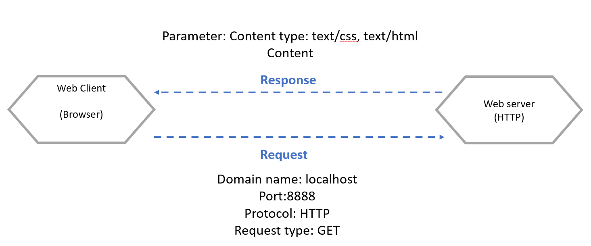
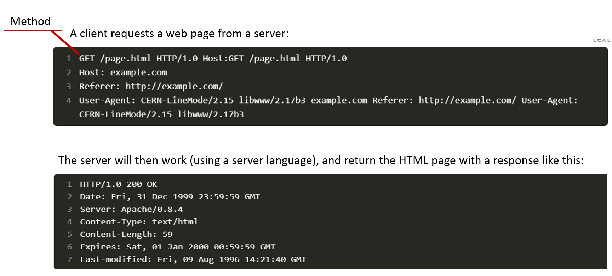
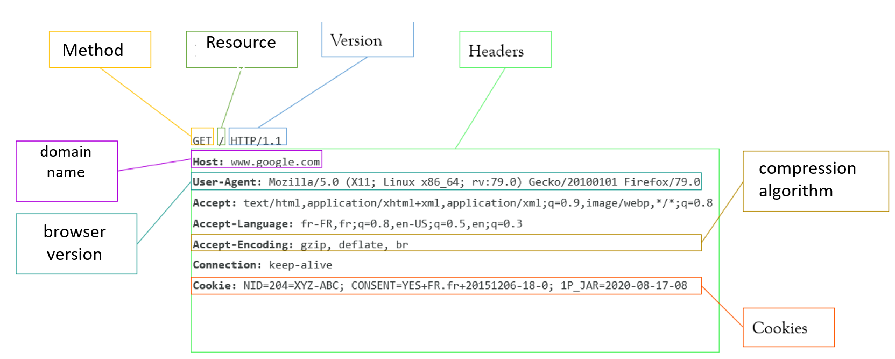
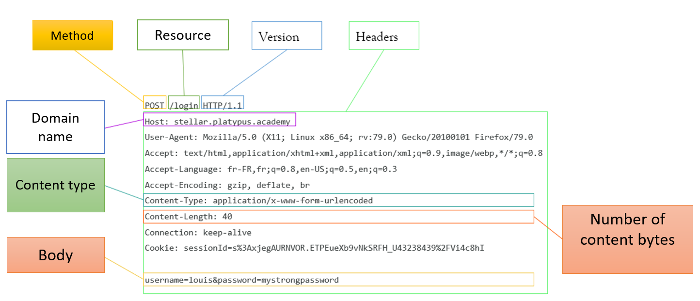
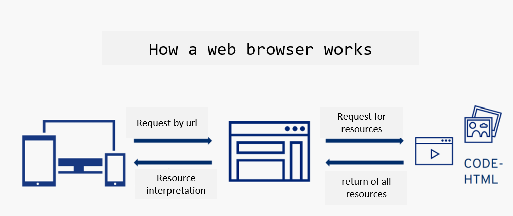
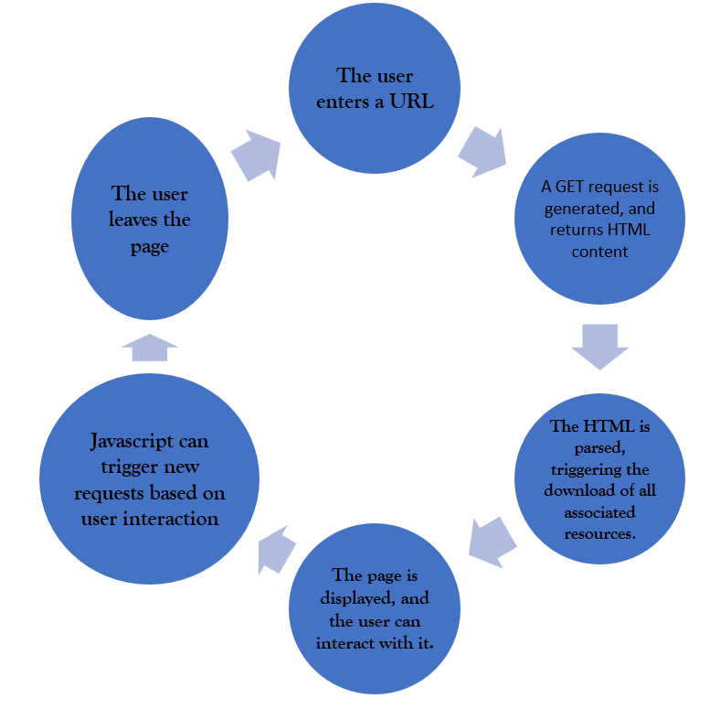

# Chapter 4: Introduction to the server side 

## 
 Table of contents 

- Web server definition 
- HTTP / HTTPS protocols 
- HTTP request methods (GET, POST) 

## 
 Web server 

A web server is a software application or hardware device that serves content to clients over the internet or an intranet using HTTP (Hypertext Transfer Protocol) or its secure variant, HTTPS (HTTP Secure). Web servers are responsible for delivering web pages, files, and other resources requested by clients, typically web browsers.

## 
 HTTP / HTTPS protocols  

How do computers communicate with each other?
What languages do they use to communicate with each other?  
&rarr; Protocols enable machines to talk to each other.

- Hypertext Transfer Protocol is a client-server communication protocol developed for the World Wide Web. 
- It enables web pages to be exchanged between client and server. HTTPS is the secure variant, using Transport Layer Security protocols.
- **low-level protocols:** 
      -  TCP: invented by vint cerf 
      -  UDP 
- **High- level protocols**:  
      - HTTP: HyperText Transfer Protocol 
      - HTTPS: Secured HTTP  
      - SMTP: send e-mails 

**
HTTP protocol basic principle
**

{:style="width:600px;height:250px;"} 

**
HTTP protocol: Example
**

{:style="width:600px;height:300px;"} 

**
Different codes sent with the server response
**

- Each HTTP response contains a status code, which is a number indicating whether or not the request was successful. 
- There are many possible codes, including the following: 
**1XX Information**: The request has not been completed, but is in progress.
**2XX Success**: Query completed successfully. 
**3XX Redirection** 
**4XX Client-side error**: The client has sent the wrong request 
**5XX Server-side error**: The server cannot process the request due to an internal error  

- Example: 
          **200**: Successful request 
          **301 and 302**: redirection, permanent and temporary respectively 
          **401**: user not authenticated 
          **403**: access denied 
          **404**: page not found 
          **500 and 503**: server error 
          **504**: server did not respond 

## 
http request methods

- The existing methods are: GET, HEAD, POST, PUT, DELETE, PATCH, OPTIONS, CONNECT, TRACE 
**GET**: Request to retrieve data, must not modify anything on the server side 
**POST**: Sends data to a server, e.g. to add an item to a shopping cart 
**PUT**: Adds or replaces a resource on the server. 

&rarr; The difference with POST is that a PUT request is idempotent: calling it once or several times in succession will have the same effect, whereas several POST requests could have side effects, such as placing an item several times in a shopping cart. 
**
DELETE**: Delete a resource

**
PATCH**: Modify only part of a resource, unlike PUT, which sends the complete representation of the resource to be modified

&rarr;HTTP responses can contain just about anything (file, streamed content, html, css, javascript, json, etc.).

**
IP address Vs host names
**

**IP address:** 
- Every computer has an address. This is called an IP address. 
- It's a sequence of numbers like 205.89.177.26. 
- It can be seen as a kind of telephone number. 
- So, in theory, you can go to a website by typing the server's address directly into your address bar. 

**Host names and DNS:** 
- DNS stands for 'Domain Name System'. It translates host names into IP addresses. 
- The DNS server acts like a directory consulted by a computer when accessing another computer on a network. 
- In other words, the DNS server is the service that associates an IP address with a web site (or a connected computer or server), just as a telephone directory associates a telephone number with a subscriber's name. 

**
Anatomy of an HTTP GET request
**

{:style="width:600px;height:250px;"} 

**
Anatomy of an HTTP POST request
**

{:style="width:600px;height:250px;"} 

**
Anatomy of an HTTP GET response
**
{:style="width:600px;height:250px;"} 

- Some queries may also contain a body, i.e. data such as files, or query elements too large to be contained in the query part of the request.

- The methods used to transmit a body are: POST, PUT, DELETE, PATCH

- When a request contains a body, the Content-Type header is used to define the type of request.

- A POST request is generally sent from an HTML form, and causes a change on the server.

- When a form is sent, several body formats may appear: 
**application/x-www-form-urlencoded**: series of keys=values separated by '&'. 
**multipart/form-data**: each value is sent as a block of data, with a delimiter separating each part  
**application/json**: the form is sent as a json {"key1": "value1", "key2": "value2"}. 

- The body type depends strongly on the type of data sent.

**
The browser (client)
**

- In an HTTP request, the browser is the client.
- The browser makes HTTP requests at several points in the life cycle of a web page:
- When the page first loads, when the user enters the site URL
- When the HTML contains script, css, image or equivalent tags that need to be retrieved.
- When the user clicks on a link and changes page  
{:style="width:600px;height:250px;"} 

**
Web page life cycle
**
{:style="width:600px;height:500px;"} 

