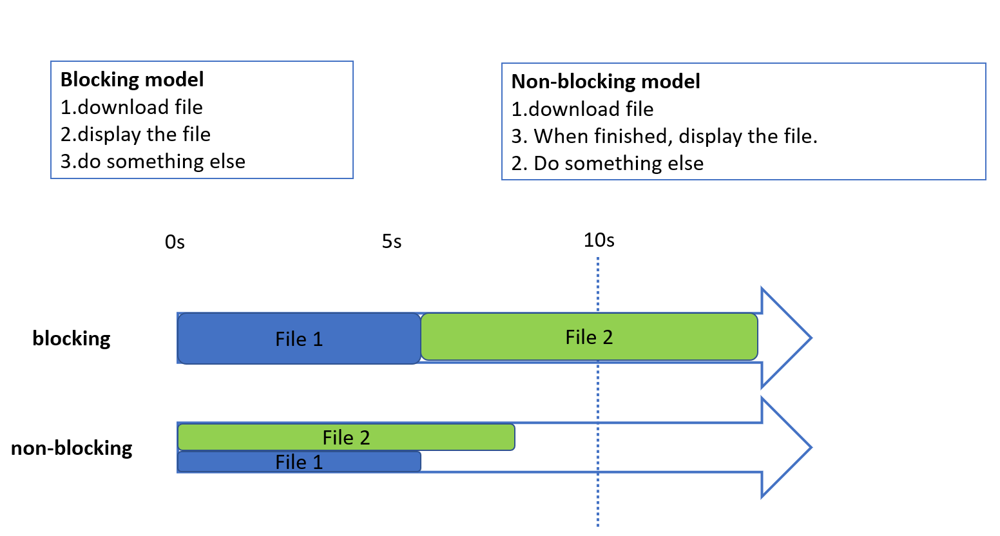
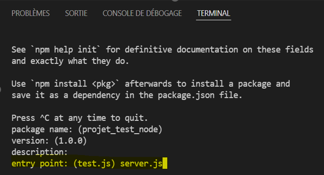

# Chapter 5 : Node.js / Express.js

## <div style="color: Royalblue;"> Table of contents </div>

- Introduction to Node.js
- Node.js modules
- Framework Express.js
- Routing
- Cookies

## <div style="color: Royalblue;"> Node.js server </div>

- A web server enables you to store web content and make it accessible to users in a secure manner. When you load an Internet address into your web browser, the elements you see on a page are always sent to your computer from a web server.

- For a website to be accessible at all times, the web server on which it is hosted must be permanently connected to the Internet.

- Node is the runtime that allows us to write all our server-side tasks in JavaScript, such as business logic, data persistence and security.

- The Node.js server is a computer server that uses Node.js as an execution platform to run server applications written in JavaScript. <br>

- Unlike traditional servers that use server-side programming languages such as PHP, Java, Python, etc., Node.js servers leverage Google Chrome's V8 JavaScript engine to execute server-side JavaScript code.<br>

- The Node.js server can be used for a variety of tasks, such as building web applications, implementing APIs (application programming interfaces), manipulating files, accessing databases and more. <br>

- Thanks to its asynchronous, non-blocking nature, Node.js can handle large numbers of simultaneous connections efficiently.<br>


{:style="width:600px;height:300px;"}</br>

{:style="width:500px;height:350px;"}</br>

**<div style="color: Royalblue;">My first file with Node JS</div>**

- To install Node Js, download it from this link: [NodeJs](https://nodejs.org/en/download)
- After installation, you can view the version of Node Js installed by typing:
`node -version`, from a cmd terminal or from windows powershell.

- Create a new hello.js file under the desktop (or another folder), and add these two lines:

```js linenums="1"
// hello.js file

var msg='Hello World';
console.log(msg);
```

- Execute the file from the terminal by typing:`node Hello.js`

**<div style="color: Royalblue;">Modules in Node JS </div>**

- Node also has a module manager called npm (Node Package Manager).<br>
- Node.js has a very rich environment of modules, called "dependencies". <br>
- Unlike Python, which contains many built-in modules, Node.js has very few of them. 
- Modules are installed with the command: `$npm install <module name>` <br>
- Modules are saved in the node_modules subfolder of the current project. 
When using git, you should never save node_modules in the git, as this causes numerous problems.
- Modules required for program operation are declared in the package.json file <br>

- Dependency management is based on a list of dependencies located in a package.json file. To initialize the project and this file, simply launch a command prompt in your project folder and use the command : `$npm init`

- This process generates a blank package.json file containing the project name (in lower case only), author, version, description and more. This file will contain all the details of all npm packages.

- In this initialization stage, you need to skip all the parameterization steps except the "Entry point", where you need to specify the main, in this case the "server.js" file (not yet created).

{:style="width:300px;height:150px;"}</br>

**<div style="color: Royalblue;">Create Node Server</div>**

- The code below allows you to create a Node server: 

```js linenums="1"
const http = require ('http');   // Import package, access http object 
const server = http.createServer((req, res) => { // create the server using the http package's createServer function. This method takes two arguments: the request and the response (req and res).

res.end('Here is the server response!'); // This method will be called every time the server receives a request: it's the server response
});// now we have a server 
server.listen(process.env.PORT || 3000); // the server will wait for requests sent to a port (by default 3000), "process.env.PORT", when the environment on which your server is running sends you a port to use.

//This program listens to HTTP requests and responds to them.

```
- Node uses the **CommonJS** module system, so you can import the contents of a JavaScript module.

- We use the require keyword rather than the import keyword. This system is particularly useful as it allows us to import Node's basic modules very easily (such as the http module) without specifying the exact path of the file.

- Node knows that it must import a basic module if you don't specify a relative path (starting with ./ or / , for example).

- To start the server, use `$node server` (if your file is server.js)

## <div style="color: Royalblue;"> Express.js </div>

- Express.js was created in 2010 by TJ Holowaychuk.
- Web framework: set of functionalities for creating a Web API.
- Framework without opinions
- Express is a Node-based framework that makes it easy to create and manage Node servers.

**<div style="color: Royalblue;">First Express application</div>**

- Install Express: To add Express to your project, run the following command int the terminal from your folder:`$npm install express –-save`

- We created an app.js file in the project folder and added the code below:

```js linenums="1"
const express = require('express');// To import the express package, use the require command

const app = express();// to create an express application

app.use((req, res) => {
   res.json({ message: 'Your request has been received!' }); 
});// If you try to make a request to your server, you'll need to retrieve a JSON object containing the message we've specified.

module.exports = app;// we're going to export this application (this constant) so that it can be used to access other files in our folder, in particular our node server.
```
- In the file server.js, we need to modify it like this: 

```js linenums="1"
const http = require('http');
    const app = require('./app'); // Import our express application

    app.set('port', process.env.PORT || 3000);// We need to tell the express application which port to run on

    const server = http.createServer(app); // set the express app as an argument to the createServer method

    server.listen(process.env.PORT || 3000);
```

**<div style="color: Royalblue;"> Middlewares</div>**

- An Express application is basically a series of functions called middleware.

- Each piece of middleware receives request and response objects, can read them, analyze them and manipulate them as required.

- Express middleware also receives the next method, which allows each middleware to pass execution to the next middleware.

- A middleware is simply a function that takes the request and response as parameters and passes the response to the next middleware (i.e. another function).

- **Example**: We added middleware to app.js

```js linenums="1"
const express = require('express');

const app = express();

app.use((req, res, next) => {
console.log('Request received!');
  next();
}); // The first middleware that registers "Request received!" in the console and passes on execution


app.use((req, res, next) => {
  res.status(201);
  next();
}); //The second middleware adds a 201 status code to the response and passes execution

app.use((req, res, next) => {
  res.json({ message: 'Your request has been received!' });
  next();
}); //The third middleware sends the JSON response and passes execution;

app.use((req, res, next) => {
  console.log('Answer sent successfully!');
}); // The last middleware registers "Response sent successfully!" in the console, so it doesn't need to call the next() function at the end, because it's the last middleware.

module.exports = app;
```

&rarr;The Express framework is installed and registered in the .json package with `$npm install` express .

&rarr;To create an Express application, simply call the express() method.

&rarr;Middleware is a block of code that handles your application's requests and responses.

## <div style="color: Royalblue;">Routing</div>

- Express makes it easy to manage multiple routes: a routing method is derived from one of the HTTP methods, and is linked to an instance of the express class.

- **Example of a get and post route:** The following code is an example of the routes that are defined for GET and POST methods to the application route.

```js linenums="1"
//GET method route
app.get('/',function(req,res){
    res.send('GET request to the homepage')
});

//POST method route
app.post('/',function(req, res){
    res.send('POST request to the homepage');
});
```
&rarr;Note that you can replace "get" with any HTTP request method you wish to process (GET, POST, PUT, DELETE, PATCH, etc.). You can also use "all" if you want to accept all methods.

&rarr;This feature makes it very easy to create a REST API with Express.

**<div style="color: Royalblue;">Route parameters</div>**

Each time a request is received, the parameters are received in the req object, and divided into 3 parts:<br>
- **req.query**: GET params GET /user?id=1<br>
- **req.body**: POST params, not visible to the user<br>
- **req.params**: framework-specific: GET /user/1<br>

**<div style="color: Royalblue;">app.all() method</div>**

- There is a special routing method, app.all(), which is not derived from an HTTP method. This method is used to load middleware functions to a path for all request methods.

- In the following example, the handler will be executed for '/secret' requests, whether you use GET, POST, PUT, DELETE or any other HTTP request method supported in the http module.

```js linenums="1"
app.all('/secret', function(req,res,next){
    console.log('Accessing the secret section...');
    next();//pass control to the next handler
});
```

## <div style="color: Royalblue;">Cookies</div>

- Cookies are the mechanism by which browsers identify themselves on web sites.

- A cookie is a key=value character string specific to each domain name, sent by the browser each time a new request is made to the same domain name.

- The cookie generally contains no information itself, but is merely an identifier enabling the server to find the user's session in its database.

- Example of a cookie: sessionId=s%3AxjegAURNVOR.ETPEueXb9vNkSRFH_U43238439%2FVi4c8hI

- Cookies are particularly sensitive information that must be protected at all costs.
Stealing a cookie is tantamount to usurping a user's identity

## <div style="color: Royalblue;">Session</div>

- Sessions are a way of identifying the user through requests
- You can link a session to a user account
- **A req.session object** is shared between requests
Anything you write to it will be specific to the current user

- Example: 

```js linenums="1"
 const users = [/** users **/]
 app.post('/login', (req, res, next) => {
  const { login, pw } = req.body          // POST request fields
    if (req.session.userId) {             // if userId has already been defined
    res.status(401)                       // we know that a login request
    res.send("you are already connected") // has already succeeded
    return
  }
                                          // Otherwise, we check the field in users
  const user = users.find(u => u.login === login && u.password == pw)
  if (user) {                             // if the user is found
    req.session.userId = user.id          // define the session's userId field
    res.send("OK")
    return
  }
  res.status(401)
  res.send("didn’t find any user matching your id and password")
  })
```

  - Get User: An example of the use of middleware, here with express-session to manage user sessions.

```js linenums="1"
   const express = require('express');
   const session = require('express-session');
   const app = express();
   
   app.use(session(/* stuff */))
   
   app.use(async (req, res, next) => {
  try {
    req.user = await db.getUser(req.session.userId);
  } catch (err) {
    next(err);
  }
  })

  app.get('/me', (req, res, next) => {
     res.json(req.user);
     })
```

## <div style="color: Royalblue;"> Practical work </div>

- Creation of a Vue CLI project
- Translation of project pages (html, css and javascript) into components
- Configuration of the different routes in index.js file.

