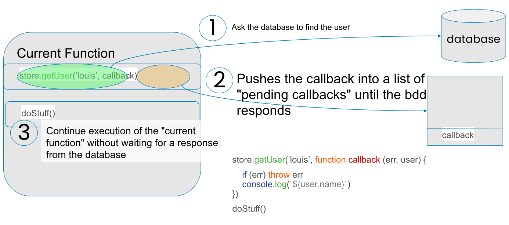
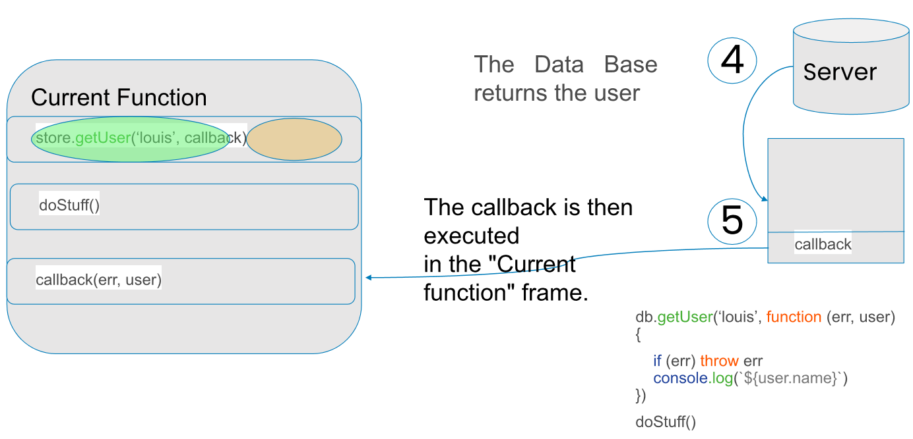

# Chapter 6: Authentication and database (security, data persistence)
 
## <div style="color: Royalblue;"> Table of contents </div>

- Authentication: user registration, hash with bcrypt
- Connecting a MySQL database to a Node.js application
- Executing SQL queries on a MySQL database with NodeJS
- Using a MySQL database in NodeJS with Sequelize

## <div style="color: Royalblue;">some concepts to know before you start</div>

**<div style="color: Royalblue;">Data flow</div>**

{:style="width:600px;height:300px;"}</br>

{:style="width:600px;height:300px;"}</br>

**<div style="color: Royalblue;">Reminder: With callbacks </div>**

```js linenums="1"

 store.getUser('louis', (err, user1) => {
 if (err) throw err
 store.getUser('jean-pierre', (err, user2) => {
 if (err) throw err
 store.getUser('marie', (err, user3) => {
 if (err) throw err
 console.log(`${user1.name} and ${user2.name} and ${user3.name}`)
   })
  }) })

```
<div style="color: Red;"> → This can be a nightmare if you have several callbacks where each one requires the result of the previous operation </div>

**<div style="color: Royalblue;">Reminder: With promises </div>**

```js linenums="1"
const washThePlates = new Promise(/** clean plates **/)
washThePlates
.then(function (numberOfPlates) {
return startWashingKnives() // startWashingKnives() return a Promise })
.then(function () { //  “then” is called if and only if the knives are clean
return startSleeping() // startSleeping() returns also a Promise })
.catch(function (err) {
console.error('something went wrong', err) })))

```
<div style="color: Red;"> → With promises, asynchronous code can be clean. You can instantly understand the sequence of events </div>

**<div style="color: Royalblue;">Reminder: With the promises and arrow functions</div>**

```js linenums="1"
    db.getUser(‘louis’)
    .then(user1 => { return db.getUser(‘jean-pierre’)
    .then(user2 => { return db.getUser(‘marie’)
    .then(user3 => {
    console.log(`${user1.name} and ${user2.name} and ${user3.name}`)}) 
    })
    })
.catch((err) => { console.error(“something went wrong”, err) })

```

→ You can pass "stringified json" to "body". <br>

→ To analyze the search result, you need to transform it with response.json().<br>

**<div style="color: Royalblue;">Async/ Await</div>**

**The async** and **await** keywords are features introduced in ECMAScript 2017 (ES8) to facilitate promise management and make asynchronous code more readable and easier to understand. They are often used in conjunction with promises to simplify the syntax of asynchronous operations.<br>

**async:** <br>
**The async** keyword is used to declare an asynchronous function. A function declared with **async** always returns a **promise**. Within an async function, you can use the **await** keyword to suspend execution of the function until a promise is resolved, and return the resolved value of the promise. <br>

```js linenums="1"
async function getUsers () {
const user1 = await db.getUser(‘louis’)
const user2 = await db.getUser(‘jean-pierre’)
const user3 = await db.getUser(‘marie’)
return '${user1.name} and ${user2.name} and ${user3.name}'
}
try {
const result = await getUsers()
console.log(result)
} catch (err) {
console.error(“something went wrong”, err)
}
```
→ **await**: If the value of the expression is not a promise, it is converted to a resolved promise with this value.<br>

**<div style="color: Royalblue;">fetch et await</div>**

- Using fetch with await and async is cleaner

```js linenums="1"

async function login (username, password) {
try {
const response = await fetch('/api/login', {
method: 'POST',
headers: { 'Content-Type': 'application/json' }, body: JSON.stringify({ username, password })
})
const data = await response.json() console.log('data', data)
} catch(err) {
console.error('network error', err)
}
}

```

**<div style="color: Royalblue;">axios</div>**

**Axios** is a module designed to simplify web requests <br>

- Axios is a promise-based HTTP client designed for Node.js and the browser
designed to simplify web requests <br>

- With Axios, we can easily send asynchronous HTTP requests to REST APIs
and perform create, read, update and delete operations.<br>

- It's an open source collaboration project hosted on Github.<br>
- You install it by running the following command: `npm install axios` <br>

- Lorsque nous envoyons une requête à l’API à l’aide d’axios, elle renvoie une réponse. L’objet de réponse se compose de : <br>

    -  **data** : les données renvoyées par le serveur.<br>
    -  **status** : le code HTTP renvoyé par le serveur.<br>
    - **statusText** : le statut HTTP renvoyé par le serveur.<br>
    - **headers** : en- têtes obtenus du serveur.<br>
    -  **config** : la configuration de la requête d’origine.<br>
    -  **request** : l’objet de la requête <br>

**Example:**

```js linenums="1"
async function login(username, password) {
try {
const response = await axios.post('/api/login', {
username, password
})
console.log('data', response.data) } catch (err) {
console.error('network error', err)
}
```

```js linenums="1"
async function login (username, password) {
try {
const response = await fetch('/api/login', {
method: 'POST',
headers: { 'Content-Type': 'application/json' }, body: JSON.stringify({ username, password })
})
const data = await response.json() console.log('data', data)
} catch(err) {
console.error('network error', err)
}
```

## <div style="color: Royalblue;">Authentication: user registration, hash with bcrypt</div>

The purpose of authentication is to be able to know who is a user<br>

- The purpose of authorization is to:

- authorize or deny an action

- log who initiated the action

- First and foremost: NEVER store a password in clear text in a database

- plaintext = readable, without having passed through a hash mechanism

- Authentication to a web site involves sessions, which work thanks to cookies
stored on the user's computer

- When the user enters his login and password, it is verified that he is a user.
login and password are identical

- If necessary, we associate the user id with the session:
`req.session.userId = user.id`


**<div style="color: Royalblue;">Hashage: bcrypt</div>**

- When the user registers, we check that no other user has the same e-mail address, to avoid collisions. <br>
- Next, we hash the password, generally using the bcrypt module <br>
- We store the email and password in their hashed form in the database <br>
- When the user logs in, we retrieve the entry in the database with the identical email address <br>
- Next, we use the function bcrypt.compare(mdpForm, mdpHashéEnBDD) <br>
- This asynchronous function returns true if the two passwords are identical, false otherwise: <br>

```js linenums="1"
if (await bcrypt.compare(mdpForm, mdpHasheBDD)) {
// congrats
} else {
// go out !
}
```

- A hash function is a special function that calculates a digital fingerprint from input data, which is used to quickly identify the initial data, in the same way as a signature is used to identify a person. Hash functions are used in computing and cryptography, for example, to quickly identify files or passwords. 

- When manipulating passwords, the aim is to make it as hard as possible for an attacker to steal the passwords of users

- A password in its hashed form takes a very long time to recover.

- With the right algorithms, such as bcrypt or argon2, the time is so long that passwords are considered "safe".

- Paradoxically, this is one of the few areas in computing where you want the algorithm to take as long as possible to execute, even on a graphics card or dedicated circuit

**<div style="color: Royalblue;">Bcrypt: installation</div>**

- Install dependency with NPM: `npm install bcrypt -save`

- Example of password hashing 

```js linenums="1"
const bcrypt=require('bcrypt');
const saltRounds = 10;
const yourpassword = "mypassword";
const hashedPassword='';

bcrypt.hash(yourpassword, saltRounds,(err, hash)=> {
    hashedPassword= hash;
})
```

- Example of password verification :

```js linenums="1"
const bcrypt=require('bcrypt')

//load hash from the bd, which was previously stored

bcrypt.compare(myPlaintextPassword, hashedPassword, function(err, res)
{
    if(res==true)
    {
        //password matched
    } else {
        //wrong password
    }
});
```

**<div style="color: Royalblue;">Authorization</div>**

- Authorization consists in determining whether a particular user has access rights to a resource.

- If you want to check that the user is logged in, simply check that the req.session.userId variable has been defined in a route

```js linenums="1"

router.get('/api/articles', (req, res) => {
if (typeof req.session.userId !== 'number') {
res.status(401).send({ message: 'You cannot access the articles because you are not logged in' }) return
}
// reste de la fonction .....
})
```

- Similarly, if you want to check that the user has special rights, you can perform any other type of check.

- In general, a logged-in user can have one or more profiles (simple user, administrator, etc.).

- The user profile can be stored as a field in the User table or in a separate table (relationship
1-N)

- You can also store the profile in the session and use it later to verify authorization.

## <div style="color: Royalblue;">Connecting a MySQL database to a Node.js application</div>

- The purpose of a database (MySQL, MariaDB, PostgreSQL, SQL Server, ...) is to enable data to be
persist data, i.e. store it durably

- The web server (in this case, Node.js), by contrast, sends the data to the client, process the information received and save it in the DB.

- The web server can be seen as the interface between the user and the database

- Generally speaking, the database is communicated with via SQL queries

- Several NodeJS libraries enable you to establish a connection with a MySQL database and execute queries.Among them, the two most popular are: <br>

     ✓ **mysql**, a basic MySQL driver for Node.js written in javascript and requiring no compilation. It's the quickest and easiest way to interact with a MySQL database in Node.<br>

     ✓ **Sequelize**, the most popular library for using SQL-based database management systems database management systems with Node.js. It supports MySQL as well as Postgres, Microsoft SQL, MariaDB... This powerful ORM (Object-Relational Mapping) allows, among other things, the use of promises and the customization of error messages for each field.<br>

**<div style="color: Royalblue;">Utiliser une base de données MySQL en NodeJSavec Sequelize</div>**

- To use Sequelize to interact with your MySQL database in Node, you first need to install the **mysql2** driver. This is a separate driver from the mysql module, less popular than the latter, but offering some additional functionality.

     ✓ Install **mysql2** with npm install : `npm install mysql2` <br>

     ✓ To install Sequelize, type: `npm install sequelize` <br>

     ✓ In your app code, initialize Sequelize with **require()** : `const { Sequelize}=require('sequelize')`

     ✓ In a new Sequelize object, specify the user name, username, password and MySQL database name to establish the connection:

     ```js linenums="1"
     const sequelize=new Sequelize("DB_name","user_name","user_password", {
        dialect: "mysql",
        host: "localhost"
     });
     ```

     ✓ Finally, you can check that the connection has been established with authenticate(): 

     ```js linenums="1"
     try{
        sequelize.authenticate();
        console.log('connected to mysql data base');
     }catch(error)
     {
        console.error('connexion error',error);
     }
     
     ```
     → This part is not required to run queries on your database

     ✓ With the query() function, you can execute any SQL query on your database:

     ```js linenums="1"
     const sequelize=new Sequelize("Mybdd", "user_name", "user_password", {
        dialect:"mysql",
        host:"localhost"
     });

     try {
        sequelize.authenticate();
        console.log('connected to my sql data base!');
        sequelize.query("SELECT students.id as 'student_id', students.name as 'student_name', students.course_id, course.name as 'course_name', course.date as 'course_date' FROM students JOIN course on students.course_id=course.id ").then(([results, metadata])=>{
            console.log(results);
        })
     }catch(error)
     {
        console.error('unable to connect', error);
     }

     }
     ```

## <div style="color: Royalblue;"> Practical work </div>
- Implement http methods on the project website.
- Create and configure a database for project website. 