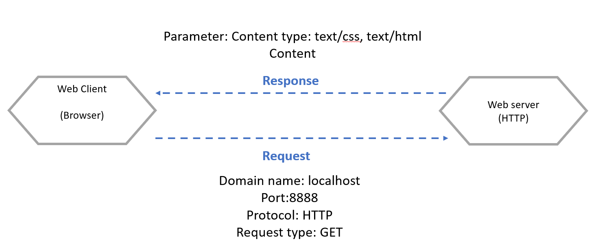
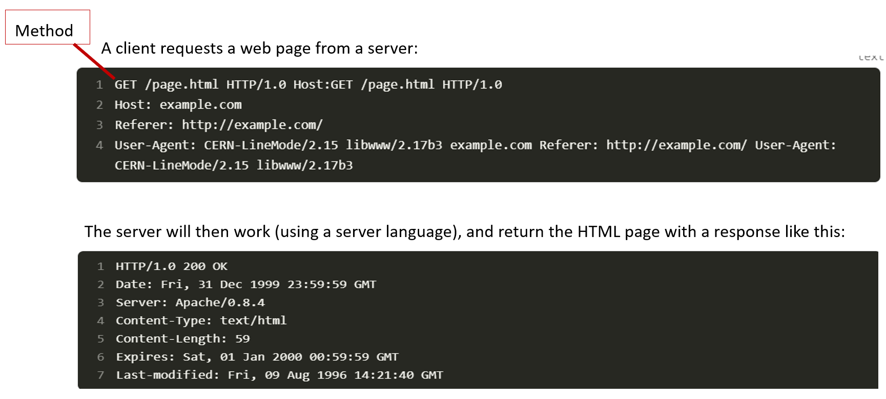
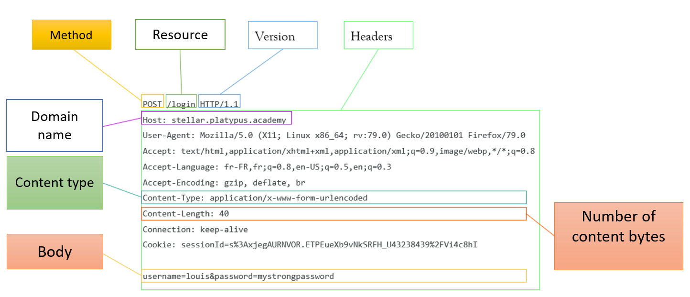
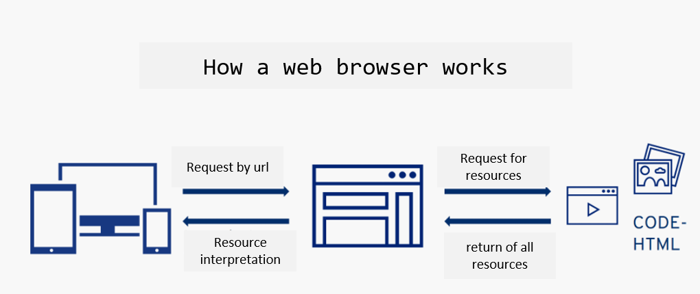
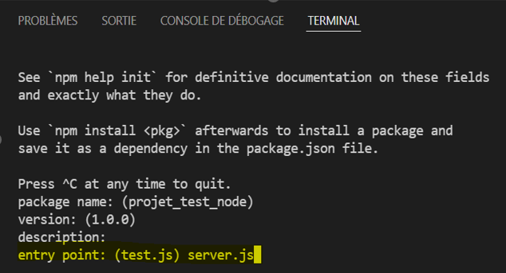

# Week 2: Week 2: From March 4 to March 8 


# Chapitre 3: Discover a modern web framework: Vue.Js 

## <div style="color: Royalblue;"> Table of contents </div>

- Introduction to Vue.js
- Installation
- Vue instance
- Directives Vue.js
- Components
- Single File Component (SFC)
- Vue Router

## <div style="color: Royalblue;">Introduction to Vue.js</div>

**<div style="color: Royalblue;">Why use a web framework?</div>**

- Ease of development
- Saves development time
- Ease of maintenance
- Abstraction of low-level functionality

**<div style="color: Royalblue;">Presentation</div>**
{:style="width:200px;height:180px;"}</br>

- Vue3 is the default version since February 2022 (Vue3 release date: January 2020 ).</br>

- Modern framework used on a large scale.</br>

- Lean and flexible front-end Framework. </br>

- Similar to related frameworks such as Angular and React.js.</br>

- **Reactive** : vue automatically tracks changes in JavaScript state and efficiently updates the DOM when changes occur.</br>

- **Conditional rendering**: `(v-if, v-else, v-for … )`. </br>

- Many developement tools : **Vue-CLI**, **Vue-router**, **Vuex-Store**, **ESLint plugin** … </br>

**<div style="color: Royalblue;">Comparison with Angular and ReactJs</div>**

{:style="width:600px;height:250px;"}</br>

- Stars on GitHub are a measure of a project's popularity among GitHub users.  it gives a general indication of its popularity within the developer community: 

{:style="width:600px;height:250px;"}</br>

**<div style="color: Royalblue;">Single Page Application SPA</div>**

- SPAs allows users to load a web page only once. 

- A separate update of the page rather than the entire page, which allows the user to interact much more dynamically. 

- Control the launch of new pages within the same domain, no more complete page refreshes are required. 

- UX improvement.

{:style="width:600px;height:250px;"}</br>

## <div style="color: Royalblue;">Installing Vue.js</div>

- Either by including the script:
```html
<script type = "text/javascript" src="https://cdn.jsdelivr.net/npm/vue/dist/vue.js"> </script>
```

- Either by using NPM (Node Package Manager): `npm install vue` <br>

<span style="color: Red;">Rq: if you're going to use the manage npm package, you'll need to install the nodejs server:</span> [installing nodejs](https://nodejs.org/en/download)

## <div style="color: Royalblue;">Vue instance</div>

- In Vue.js, a "Vue instance" refers to a Vue application instance created using the Vue constructor. 
- A Vue instance is the entry point to any Vue.js application and represents the entire Vue application.

- A view instance is created by passing options:<br>
     1- **el**: the id of the HTML element to which we want to apply the view.<br>
     2- **data**: the data to pass to the view.<br>
     3- **Methods**: methods to call from the view <br>
     4- **Computed**: these are methods that do not change results if they are called several times<br>

```html linenums="1"
<html>
    <head>
    <script type = "text/javascript" src="https://cdn.jsdelivr.net/npm/vue/dist/vue.js"> </script>
    </head>
    <body>
        <div id="app">
            <p>{{message}}</p>
            <p>{{num}}</p>
            <button @click="randomnumber">Update</button>
            <p>{{ rand }}</p>
            <p>{{ rand }}</p>
        </div>
        <script>
            new vue({
                el:'#app',
                data(){
                 return { 
                    message:'hello world'
                    num:0
                };
                },
                methods:{
                    randomnumber(){
                        this.num=Math.random();
                    }
                },
                computed:{
                    rand(){
                        return Math.random();
                    }
                }
            })
        </script>
    </body>
</html>

```
➔Here the data and the DOM are coupled, and everything is now declarative. If the message variable is modified in JavaScript, the template will be automatically updated.

➔There is no longer any need to interact directly with HTML (An application attaches to a single DOM element (#app in our case) and then controls it entirely).

## <div style="color: Royalblue;">Vue.js: Directives(Rendering)</div>


**<div style="color: Royalblue;">V-text : Update the textual content of the element.</div>**

- **Param** : string
- **Details** : works by setting the element's textContent property, so it will overwrite any existing content inside the element.

```html linenums="1"
<span v-text="msg"></span>
<!--same as -->
<span>{{msg}}</span>
```
**<div style="color: Royalblue;">V-html : Update the textual content of the element.</div>**

- **Param** : string
- **Details** : v-html content is inserted as raw html

```html linenums="1"
<html>
    <head>
    <script type = "text/javascript" src="https://cdn.jsdelivr.net/npm/vue/dist/vue.js"> </script>
    </head>
    <body>
        <div id="app">
            <p v-html="msg"></p>
            
        </div>
        <script>
            new vue({
                el:'#app',
                data(){
                 return { 
                    message:"<h1>it's a title</h1>" 
                };
                },
            })
        </script>
    </body>
</html>
```
**<div style="color: Royalblue;">V-if/ v-else-if /v-else : Conditionally render a template element or fragment based on whether the expression value is true.</div>**

- **Param** : condition
- **Details** : check if the parameter content is true
```html linenums="1"
<html>
    <head>
    <script type = "text/javascript" src="https://cdn.jsdelivr.net/npm/vue/dist/vue.js"> </script>
    </head>
    <body>
        <div id="app">
        <div v-if="type=='A'">
          A
        </div>
        <div v-if="type=='B'">
          B
        </div>
        <div v-if="type=='C'">
          C
        </div>
        <div else>
          Not A/B/C
        </div>
        </div>
        <script>
            new vue({
                el:'#app',
                data(){
                 return { 
                    type="Z"
                };
                },
            })
        </script>
    </body>
</html>
```

**<div style="color: Royalblue;">V-on : attach an event listener to an element</div>**
- **Param** : method
- **Details** : The type of event is indicated by the argument. The expression can be a method name or an inline statement

```html linenums="1"
<!--method handler-->
<button v-on:click="doThis">click</button>

<!--dynamic event-->
<button v-on:[event]="doThis">click</button>

<!--inline statement-->
<button v-on:click="doThis('hello',$event)">click</button>

<!--shorthand-->
<button @click="doThis">click</button>

<!--shorthand dynamic event-->
<button @[event]="doThis">click</button>

<!--stop propagation-->
<button @click.stop="doThis">click</button>
```
**<div style="color: Royalblue;">V-bind : Dynamically bind one or more attributes or a component to an expression.</div>**

- This makes HTML attributes responsive to data changes in your Vue application.

```html linenums="1"
<html>
    <head>
    <script type = "text/javascript" src="https://cdn.jsdelivr.net/npm/vue/dist/vue.js"> </script>
    </head>
    <body>
        <div id="app">
        <p v-bind:style="{ color: textColor }">This is a text with a dynamic color.</p>
        </div>
        <script>
            new vue({
                el:'#app',
                data(){
                 return { 
                    textColor: 'red' // Text color initialization
                };
                },
            })
        </script>
    </body>
</html>
```
**<div style="color: Royalblue;">V-model : Create a two-way binding on a form input element or component.</div>**

- **Details** : varies according to the value of the form input element or component output.

Limited to : `<input>, <textarea>, <select>`


```html linenums="1"
<html>
    <head>
    <script type = "text/javascript" src="https://cdn.jsdelivr.net/npm/vue/dist/vue.js"> </script>
    </head>
    <body>
        <div id="app">
          <input type="text" v-model="message">
        </div>
        <script>
            new vue({
                el:'#app',
                data(){
                 return { 
                    message: '' //  initialization of the message
                };
                },
            })
        </script>
    </body>
</html>
```

**<div style="color: Royalblue;">V-for : to iterate over a collection of data.</div>**

```html linenums="1"
<html>
<head>
    <script src="https://cdn.jsdelivr.net/npm/vue/dist/vue.js"></script>
</head>
<body>
    <div id="app">
        <ul>
            <li v-for="item in items" :key="item.id">
                {{ item.name}}
            </li>
        </ul>
    </div>

    <script>
        new Vue({
            el: '#app',
            data() {
                return {
                    items: [
                        { id: 1, name: 'Item 1' },
                        { id: 2, name: 'Item 2' },
                        { id: 3, name: 'Item 3' }
                    ]
                };
            },
            mounted() {
                // Add a new element to items
                this.items.push({ id: 4, name: 'Item 4' });
            }
        });
    </script>
</body>
</html>
```
## <div style="color: Royalblue;">Components</div>

- Vue components are one of the important features of VueJS that creates custom elements, which can be reused in HTML.<br>

      1. Components are abstractions used to build large applications<br>
      2. They are reusable and self-contained.<br>
      3. All html views can be broken down into components<br>

{:style="width:400px;height:150px;"}</br>

- In Vue, a component is a Vue instance with well-predefined options. Example : <br>

```html linenums="1"
<html>
<head>
    <script src="https://cdn.jsdelivr.net/npm/vue/dist/vue.js"></script>
</head>
<body>
    <div id="app">
        <component1> </component1>
        <custom-list-item v-for="item in items" :key="item.id" :name="item.name"></custom-list-item>
    </div>

    <script>
        //Create component
        Vue.component('component1', {
            template: '<h1> This is the title of the component </h1>' // Template of the component
        });
        // We can also pass parameters to a component custom-list-item
        Vue.component('custom-list-item', {
            props: ['name'], // Define the property 'name' for the component
            template: '<li>{{ name }}</li>' // Template of the component
        });

        // creation of vue instance
        new Vue({
            el: '#app',
            data() {
                return {
                    items: [
                        { id: 1, name: 'Item 1' },
                        { id: 2, name: 'Item 2' },
                        { id: 3, name: 'Item 3' }
                    ]
                };
            }
        });
    </script>
</body>
</html>
```

**<div style="color: Royalblue;">Local components</div>**
- We can declare the component on the view instance.

```html linenums="1"
<html>
<head>
    <script src="https://cdn.jsdelivr.net/npm/vue/dist/vue.js"></script>
</head>
<body>
    <div id="app">
        <custom-list-item v-for="item in items" :key="item.id" :name="item.name"></custom-list-item>
    </div>

    <script>
        // creation of vue instance
        new Vue({
            el: '#app',
            data() {
                return {
                    items: [
                        { id: 1, name: 'Item 1' },
                        { id: 2, name: 'Item 2' },
                        { id: 3, name: 'Item 3' }
                    ]
                };
            },
            components:{
                // Local component
           'custom-list-item': {
            props: ['name'], // Define the property 'name' for the component
            template: '<li>{{ name }}</li>' // Template of the component
        };
            }
        });
    </script>
</body>
</html>
```

## <div style="color: Royalblue;">Single File Components - SFC</div>

- A world of components. <br>

- A component only depends on its internal data. <br>

- A component may contains sub-components. <br>

- Components are integrated in ".vue" SFC files.<br>

- A SFC file contains : <br>
        1. **The template (HTML)** : content rendering <br>
        2. **Dynamic (JS)** : content handling<br>
        3. **Style (CSS)** : content styling (scoped or global)<br>

{:style="width:200px;height:100px;"}</br>

## <div style="color: Royalblue;">Vue CLI</div>

Vue CLI is a Javascript Framework that lets you develop "Single Page Applications".<br>
- Allows you to develop applications that are made with responsive javascript<br>
- Allows the user to have a very nice and modern user experience.<br>
- A command-line interface for efficacious development.<br>
- Vue CLI requires Node.js version 8.9 or higher (for new projects, it is now recommended to use 'vue create’).<br>

```js linenums="1"
#npm install -g @vue/cli
#vue —version
#vue create myvueproject

```

- When creating VueProject (with "vue create"), you can specify certain functionalities such as Babel, Router, Vuex...<br>

**Main elements of the project View :**<br>
     - **"node_modules"  directory** : all your project's dependencies, directly managed by "npm".<br>
     - **"src" directory**: source code for your project (components, pages, etc.)<br>
     - **File "package.json"** : your project's main configuration file.<br>
     - **File ".gitignore** : contains the names of files/directories to be ignored when committing the project to Git.<br>

## <div style="color: Royalblue;">Props and Events</div>

**Objective**: Share data between different pages ( composed of components).<br>

- Props and events are used to transfer data between parent and child components.<br>

**Parent ->Child**: to update the child's `"props"` data.<br>
**Child -> Parent**: `"$emit"` event of a method or variable from the child to the parent, which retrieves the object via "v-on" or "@" directives.<br>
{:style="width:300px;height:150px;"}</br>

**Example with props:**
- **Parent component**
```html linenums="1"
<template>
  <div id="app">
    <!-- Utilisation du composant enfant et passage de la propriété 'message' -->
    <child-component message="Hello from parent"></child-component>
  </div>
</template>

<script>
import ChildComponent from './child-component.vue';

export default {
  components: {
    ChildComponent
  }
};
</script>

<style>
/* Styles globaux peuvent être ajoutés ici */
</style>
```
- **Child component**

```html linenums="1"
<template>
  <p>{{ message }}</p>
</template>

<script>
export default {
  props: ['message']
};
</script>

<style scoped>
/* Styles spécifiques au composant peuvent être ajoutés ici */
</style>
```

**Example with $emit:**<br>

- The use of `$emit` and custom events are common in Vue.js to enable communication between parent and child components. 

- Suppose you have two components, a parent called ParentComponent and a child called ChildComponent. The parent wishes to receive information from the child when a button is clicked in the child.

**Parent component**
```html linenums="1"
<template>
  <div>
    <h2>Parent Component</h2>
    <!-- Utilisation du composant enfant et écoute de l'événement 'custom-event' -->
    <child-component @custom-event="handleCustomEvent"></child-component>
    <!-- Affichage du message reçu de l'enfant -->
    <p>Message from child: {{ messageFromChild }}</p>
  </div>
</template>

<script>
import ChildComponent from './child-component.vue';

export default {
  components: {
    ChildComponent
  },
  data() {
    return {
      messageFromChild: ''
    };
  },
  methods: {
    // Fonction de gestion de l'événement personnalisé émis par l'enfant
    handleCustomEvent(message) {
      this.messageFromChild = message;
    }
  }
};
</script>
```
**Child component**
```html linenums="1"
<template>
  <div>
    <h3>Child Component</h3>
    <button @click="sendMessageToParent">Send Message to Parent</button>
  </div>
</template>

<script>
export default {
  methods: {
    // Fonction pour envoyer un message au parent via un événement personnalisé
    sendMessageToParent() {
      const message = 'Hello from child!';
      // Émettre un événement personnalisé avec le message
      this.$emit('custom-event', message);
    }
  }
};
</script>
```

## <div style="color: Royalblue;">vue-router</div>
- Users need different URLs to distinguish one page from another.

- Vue router allows components to be mapped to routes.

**`# npm install vue-router@4`         Or               `# vue add router`**


1. Configure routes: path, name and component for each route in a Js file. <br>

2. Add <router-link> and <router-view> in the given page template:<br>

**`<router-link>`**: allows Vue-router to change the Url without reloading the page.<br>

**`<router-view>`**: allows Vue-router to display the contents of the URL (mapping component).<br>

- You can see the [Official documentation](https://router.vuejs.org/) of vue router

- Example:
**AboutView.vue**
```html linenums="1"
<template>
    <div>
        <h1>About Us</h1>
        <p>About our application</p>
    </div>
</template>
```

## <div style="color: Royalblue;">Practical work</div>

- Creation of a Vue CLI project
- Translation of project pages (html, css and javascript) into components
- Configuration of the different routes in index.js file.


# Chapter 4: Introduction to the server side 

## <div style="color: Royalblue;"> Table of contents </div>

- Web server definition 
- HTTP / HTTPS protocols 
- HTTP request methods (GET, POST) 

## <div style="color: Royalblue;"> Web server </div>

A web server is a software application or hardware device that serves content to clients over the internet or an intranet using HTTP (Hypertext Transfer Protocol) or its secure variant, HTTPS (HTTP Secure). Web servers are responsible for delivering web pages, files, and other resources requested by clients, typically web browsers.


{:style="width:600px;height:250px;"}</br>


**<div style="color: Royalblue;"> what is the role of a web server? </div>**

- Website data is generally stored in a database </br>
- Relational database: MySQL, Postgres...</br>
- Non-relational: MongoDB, etc.</br>

&rarr; The role of the server is to act as an intermediary between the user and the database.</br>

&rarr;The database is never directly accessible to the user

&rarr; The role of the server in a website is to: <br>

- Store user information<br>
- Send the right information to users<br>
- Ensure data security<br>
- Check access and modification rights<br>
- Validate request consistency<br>

## <div style="color: Royalblue;"> HTTP / HTTPS protocols  </div>

How do computers communicate with each other?
What languages do they use to communicate with each other? <br>
&rarr; Protocols enable machines to talk to each other.

- Hypertext Transfer Protocol is a client-server communication protocol developed for the World Wide Web. 
- It enables web pages to be exchanged between client and server. HTTPS is the secure variant, using Transport Layer Security protocols.
- **low-level protocols:**<br>
      -  TCP: invented by vint cerf<br>
      -  UDP<br>
- **High- level protocols**: <br>
      - HTTP: HyperText Transfer Protocol<br>
      - HTTPS: Secured HTTP <br>
      - SMTP: send e-mails<br>

**<div style="color: Royalblue;">HTTP protocol basic principle</div>**

{:style="width:600px;height:250px;"}</br>

**<div style="color: Royalblue;">HTTP protocol: Example</div>**

{:style="width:600px;height:300px;"}</br>

**<div style="color: Royalblue;">Different codes sent with the server response</div>**

- Each HTTP response contains a status code, which is a number indicating whether or not the request was successful.</br>
- There are many possible codes, including the following:</br>
**1XX Information**: The request has not been completed, but is in progress.
**2XX Success**: Query completed successfully.</br>
**3XX Redirection**</br>
**4XX Client-side error**: The client has sent the wrong request</br>
**5XX Server-side error**: The server cannot process the request due to an internal error </br>

- Example:<br>
          **200**: Successful request</br>
          **301 and 302**: redirection, permanent and temporary respectively</br>
          **401**: user not authenticated</br>
          **403**: access denied</br>
          **404**: page not found</br>
          **500 and 503**: server error</br>
          **504**: server did not respond</br>

## <div style="color: Royalblue;">http request methods</div>

- The existing methods are: GET, HEAD, POST, PUT, DELETE, PATCH, OPTIONS, CONNECT, TRACE<br>
**GET**: Request to retrieve data, must not modify anything on the server side<br>
**POST**: Sends data to a server, e.g. to add an item to a shopping cart<br>
**PUT**: Adds or replaces a resource on the server.<br>

&rarr; The difference with POST is that a PUT request is idempotent: calling it once or several times in succession will have the same effect, whereas several POST requests could have side effects, such as placing an item several times in a shopping cart.<br>
**<div style="margin-left: 20px;">DELETE**: Delete a resource</div>
**<div style="margin-left: 20px;">PATCH**: Modify only part of a resource, unlike PUT, which sends the complete representation of the resource to be modified</div>

&rarr;HTTP responses can contain just about anything (file, streamed content, html, css, javascript, json, etc.).

**<div style="color: Royalblue;">IP address Vs host names</div>**


**IP address:**<br>
- Every computer has an address. This is called an IP address.<br>
- It's a sequence of numbers like 205.89.177.26.<br>
- It can be seen as a kind of telephone number.<br>
- So, in theory, you can go to a website by typing the server's address directly into your address bar.<br>


**Host names and DNS:**<br>
- DNS stands for 'Domain Name System'. It translates host names into IP addresses.<br>
- The DNS server acts like a directory consulted by a computer when accessing another computer on a network.<br>
- In other words, the DNS server is the service that associates an IP address with a web site (or a connected computer or server), just as a telephone directory associates a telephone number with a subscriber's name.<br>

**<div style="color: Royalblue;">Anatomy of an HTTP GET request</div>**

{:style="width:600px;height:250px;"}</br>

**<div style="color: Royalblue;">Anatomy of an HTTP POST request</div>**

{:style="width:600px;height:250px;"}</br>

**<div style="color: Royalblue;">Anatomy of an HTTP GET response</div>**
{:style="width:600px;height:250px;"}</br>

- Some queries may also contain a body, i.e. data such as files, or query elements too large to be contained in the query part of the request.

- The methods used to transmit a body are: POST, PUT, DELETE, PATCH

- When a request contains a body, the Content-Type header is used to define the type of request.

- A POST request is generally sent from an HTML form, and causes a change on the server.

- When a form is sent, several body formats may appear:</br>
**application/x-www-form-urlencoded**: series of keys=values separated by '&'.</br>
**multipart/form-data**: each value is sent as a block of data, with a delimiter separating each part </br>
**application/json**: the form is sent as a json {"key1": "value1", "key2": "value2"}.</br>

- The body type depends strongly on the type of data sent.

**<div style="color: Royalblue;">The browser (client)</div>**

- In an HTTP request, the browser is the client.
- The browser makes HTTP requests at several points in the life cycle of a web page:
- When the page first loads, when the user enters the site URL
- When the HTML contains script, css, image or equivalent tags that need to be retrieved.
- When the user clicks on a link and changes page </br>
{:style="width:600px;height:250px;"}</br>

**<div style="color: Royalblue;">Web page life cycle</div>**
{:style="width:600px;height:500px;"}</br>

# Chapter 5 : Node.js / Express.js

## <div style="color: Royalblue;"> Table of contents </div>

- Introduction to Node.js
- Node.js modules
- Framework Express.js
- Routing
- Cookies

## <div style="color: Royalblue;"> Node.js server </div>

- A web server enables you to store web content and make it accessible to users in a secure manner. When you load an Internet address into your web browser, the elements you see on a page are always sent to your computer from a web server.

- For a website to be accessible at all times, the web server on which it is hosted must be permanently connected to the Internet.

- Node is the runtime that allows us to write all our server-side tasks in JavaScript, such as business logic, data persistence and security.

- The Node.js server is a computer server that uses Node.js as an execution platform to run server applications written in JavaScript. <br>

- Unlike traditional servers that use server-side programming languages such as PHP, Java, Python, etc., Node.js servers leverage Google Chrome's V8 JavaScript engine to execute server-side JavaScript code.<br>

- The Node.js server can be used for a variety of tasks, such as building web applications, implementing APIs (application programming interfaces), manipulating files, accessing databases and more. <br>

- Thanks to its asynchronous, non-blocking nature, Node.js can handle large numbers of simultaneous connections efficiently.<br>


{:style="width:600px;height:300px;"}</br>

{:style="width:500px;height:350px;"}</br>

**<div style="color: Royalblue;">My first file with Node JS</div>**

- To install Node Js, download it from this link: [NodeJs](https://nodejs.org/en/download)
- After installation, you can view the version of Node Js installed by typing:
`node -version`, from a cmd terminal or from windows powershell.

- Create a new hello.js file under the desktop (or another folder), and add these two lines:

```js linenums="1"
// hello.js file

var msg='Hello World';
console.log(msg);
```

- Execute the file from the terminal by typing:`node Hello.js`

**<div style="color: Royalblue;">Modules in Node JS </div>**

- Node also has a module manager called npm (Node Package Manager).<br>
- Node.js has a very rich environment of modules, called "dependencies". <br>
- Unlike Python, which contains many built-in modules, Node.js has very few of them. 
- Modules are installed with the command: `$npm install <module name>` <br>
- Modules are saved in the node_modules subfolder of the current project. 
When using git, you should never save node_modules in the git, as this causes numerous problems.
- Modules required for program operation are declared in the package.json file <br>

- Dependency management is based on a list of dependencies located in a package.json file. To initialize the project and this file, simply launch a command prompt in your project folder and use the command : `$npm init`

- This process generates a blank package.json file containing the project name (in lower case only), author, version, description and more. This file will contain all the details of all npm packages.

- In this initialization stage, you need to skip all the parameterization steps except the "Entry point", where you need to specify the main, in this case the "server.js" file (not yet created).

{:style="width:300px;height:150px;"}</br>

**<div style="color: Royalblue;">Create Node Server</div>**

- The code below allows you to create a Node server: 

```js linenums="1"
const http = require ('http');   // Import package, access http object 
const server = http.createServer((req, res) => { // create the server using the http package's createServer function. This method takes two arguments: the request and the response (req and res).

res.end('Here is the server response!'); // This method will be called every time the server receives a request: it's the server response
});// now we have a server 
server.listen(process.env.PORT || 3000); // the server will wait for requests sent to a port (by default 3000), "process.env.PORT", when the environment on which your server is running sends you a port to use.

//This program listens to HTTP requests and responds to them.

```
- Node uses the **CommonJS** module system, so you can import the contents of a JavaScript module.

- We use the require keyword rather than the import keyword. This system is particularly useful as it allows us to import Node's basic modules very easily (such as the http module) without specifying the exact path of the file.

- Node knows that it must import a basic module if you don't specify a relative path (starting with ./ or / , for example).

- To start the server, use `$node server` (if your file is server.js)

## <div style="color: Royalblue;"> Express.js </div>

- Express.js was created in 2010 by TJ Holowaychuk.
- Web framework: set of functionalities for creating a Web API.
- Framework without opinions
- Express is a Node-based framework that makes it easy to create and manage Node servers.

**<div style="color: Royalblue;">First Express application</div>**

- Install Express: To add Express to your project, run the following command int the terminal from your folder:`$npm install express –-save`

- We created an app.js file in the project folder and added the code below:

```js linenums="1"
const express = require('express');// To import the express package, use the require command

const app = express();// to create an express application

app.use((req, res) => {
   res.json({ message: 'Your request has been received!' }); 
});// If you try to make a request to your server, you'll need to retrieve a JSON object containing the message we've specified.

module.exports = app;// we're going to export this application (this constant) so that it can be used to access other files in our folder, in particular our node server.
```
- In the file server.js, we need to modify it like this: 

```js linenums="1"
const http = require('http');
    const app = require('./app'); // Import our express application

    app.set('port', process.env.PORT || 3000);// We need to tell the express application which port to run on

    const server = http.createServer(app); // set the express app as an argument to the createServer method

    server.listen(process.env.PORT || 3000);
```

**<div style="color: Royalblue;"> Middlewares</div>**

- An Express application is basically a series of functions called middleware.

- Each piece of middleware receives request and response objects, can read them, analyze them and manipulate them as required.

- Express middleware also receives the next method, which allows each middleware to pass execution to the next middleware.

- A middleware is simply a function that takes the request and response as parameters and passes the response to the next middleware (i.e. another function).

- **Example**: We added middleware to app.js

```js linenums="1"
const express = require('express');

const app = express();

app.use((req, res, next) => {
console.log('Request received!');
  next();
}); // The first middleware that registers "Request received!" in the console and passes on execution


app.use((req, res, next) => {
  res.status(201);
  next();
}); //The second middleware adds a 201 status code to the response and passes execution

app.use((req, res, next) => {
  res.json({ message: 'Your request has been received!' });
  next();
}); //The third middleware sends the JSON response and passes execution;

app.use((req, res, next) => {
  console.log('Answer sent successfully!');
}); // The last middleware registers "Response sent successfully!" in the console, so it doesn't need to call the next() function at the end, because it's the last middleware.

module.exports = app;
```

&rarr;The Express framework is installed and registered in the .json package with `$npm install` express .

&rarr;To create an Express application, simply call the express() method.

&rarr;Middleware is a block of code that handles your application's requests and responses.

## <div style="color: Royalblue;">Routing</div>

- Express makes it easy to manage multiple routes: a routing method is derived from one of the HTTP methods, and is linked to an instance of the express class.

- **Example of a get and post route:** The following code is an example of the routes that are defined for GET and POST methods to the application route.

```js linenums="1"
//GET method route
app.get('/',function(req,res){
    res.send('GET request to the homepage')
});

//POST method route
app.post('/',function(req, res){
    res.send('POST request to the homepage');
});
```
&rarr;Note that you can replace "get" with any HTTP request method you wish to process (GET, POST, PUT, DELETE, PATCH, etc.). You can also use "all" if you want to accept all methods.

&rarr;This feature makes it very easy to create a REST API with Express.

**<div style="color: Royalblue;">Route parameters</div>**

Each time a request is received, the parameters are received in the req object, and divided into 3 parts:<br>
- **req.query**: GET params GET /user?id=1<br>
- **req.body**: POST params, not visible to the user<br>
- **req.params**: framework-specific: GET /user/1<br>

**<div style="color: Royalblue;">app.all() method</div>**

- There is a special routing method, app.all(), which is not derived from an HTTP method. This method is used to load middleware functions to a path for all request methods.

- In the following example, the handler will be executed for '/secret' requests, whether you use GET, POST, PUT, DELETE or any other HTTP request method supported in the http module.

```js linenums="1"
app.all('/secret', function(req,res,next){
    console.log('Accessing the secret section...');
    next();//pass control to the next handler
});
```

## <div style="color: Royalblue;">Cookies</div>

- Cookies are the mechanism by which browsers identify themselves on web sites.

- A cookie is a key=value character string specific to each domain name, sent by the browser each time a new request is made to the same domain name.

- The cookie generally contains no information itself, but is merely an identifier enabling the server to find the user's session in its database.

- Example of a cookie: sessionId=s%3AxjegAURNVOR.ETPEueXb9vNkSRFH_U43238439%2FVi4c8hI

- Cookies are particularly sensitive information that must be protected at all costs.
Stealing a cookie is tantamount to usurping a user's identity

## <div style="color: Royalblue;">Session</div>

- Sessions are a way of identifying the user through requests
- You can link a session to a user account
- **A req.session object** is shared between requests
Anything you write to it will be specific to the current user

- Example: 

```js linenums="1"
 const users = [/** users **/]
 app.post('/login', (req, res, next) => {
  const { login, pw } = req.body          // POST request fields
    if (req.session.userId) {             // if userId has already been defined
    res.status(401)                       // we know that a login request
    res.send("you are already connected") // has already succeeded
    return
  }
                                          // Otherwise, we check the field in users
  const user = users.find(u => u.login === login && u.password == pw)
  if (user) {                             // if the user is found
    req.session.userId = user.id          // define the session's userId field
    res.send("OK")
    return
  }
  res.status(401)
  res.send("didn’t find any user matching your id and password")
  })
```

  - Get User: An example of the use of middleware, here with express-session to manage user sessions.

```js linenums="1"
   const express = require('express');
   const session = require('express-session');
   const app = express();
   
   app.use(session(/* stuff */))
   
   app.use(async (req, res, next) => {
  try {
    req.user = await db.getUser(req.session.userId);
  } catch (err) {
    next(err);
  }
  })

  app.get('/me', (req, res, next) => {
     res.json(req.user);
     })
```
